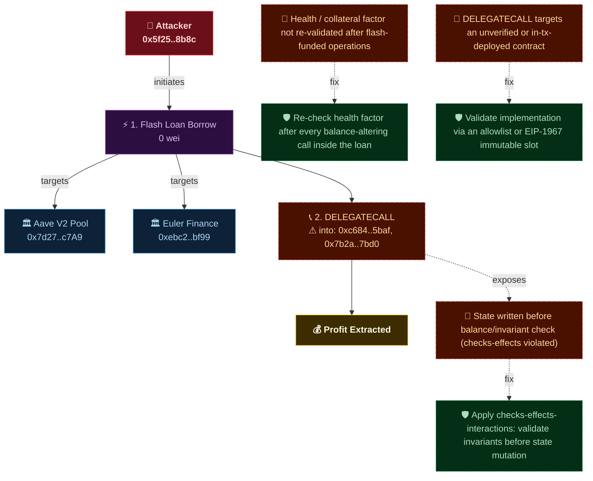

# Forensic Diagram — `0xc310a0af...111d`

- **Transaction:** `0xc310a0affe2169d1f6feec1c63dbc7f7c62a887fa48795d327d4d2da2d6b111d`
- **Attacker:** `0x5f259d0b76665c337c6104145894f4d1d2758b8c`
- **Target:** Aave V2 Pool `0x7d2768dE32b0b80b7a3454c06BdAc94A69DDc7A9`
- **Target:** Euler Finance `0xebc29199c817dc47ba12e3f86102564d640cbf99`
- **EVM Frames:** 89,623
- **Semantic Actions:** 139
- **Edges:** 138

### Action Breakdown

| Type | Count |
|------|-------|
| storage_write | 95 |
| delegate_call | 36 |
| token_transfer | 7 |
| flash_loan_borrow | 1 |

## Forensic Flowchart

## Flowchart

```mermaid
graph TD
    flash_loan_borrow_1783["⚡ Flash Loan Borrow"]
    delegate_call_1880["📞 Delegate Call"]
    delegate_call_3181["📞 Delegate Call"]
    token_transfer_3543["💸 Token Transfer"]
    storage_write_3735["✍ Storage Write"]
    storage_write_3800["✍ Storage Write"]
    storage_write_5298["✍ Storage Write"]
    storage_write_5535["✍ Storage Write"]
    token_transfer_5615["💸 Token Transfer"]
    storage_write_5807["✍ Storage Write"]
    storage_write_5872["✍ Storage Write"]
    storage_write_7321["✍ Storage Write"]
    delegate_call_7968["📞 Delegate Call"]
    storage_write_8060["✍ Storage Write"]
    storage_write_10248["✍ Storage Write"]
    storage_write_10267["✍ Storage Write"]
    storage_write_10288["✍ Storage Write"]
    storage_write_10296["✍ Storage Write"]
    token_transfer_10590["💸 Token Transfer"]
    storage_write_10842["✍ Storage Write"]
    storage_write_10907["✍ Storage Write"]
    storage_write_11840["✍ Storage Write"]
    storage_write_11902["✍ Storage Write"]
    delegate_call_12275["📞 Delegate Call"]
    storage_write_12654["✍ Storage Write"]
    storage_write_13194["✍ Storage Write"]
    delegate_call_13727["📞 Delegate Call"]
    storage_write_13821["✍ Storage Write"]
    storage_write_15207["✍ Storage Write"]
    storage_write_15269["✍ Storage Write"]
    delegate_call_15642["📞 Delegate Call"]
    storage_write_16021["✍ Storage Write"]
    storage_write_16585["✍ Storage Write"]
    storage_write_16595["✍ Storage Write"]
    storage_write_16678["✍ Storage Write"]
    storage_write_16729["✍ Storage Write"]
    storage_write_16821["✍ Storage Write"]
    storage_write_16888["✍ Storage Write"]
    delegate_call_17261["📞 Delegate Call"]
    storage_write_17703["✍ Storage Write"]
    delegate_call_18470["📞 Delegate Call"]
    storage_write_21661["✍ Storage Write"]
    delegate_call_22208["📞 Delegate Call"]
    storage_write_22305["✍ Storage Write"]
    token_transfer_23653["💸 Token Transfer"]
    storage_write_23905["✍ Storage Write"]
    storage_write_23970["✍ Storage Write"]
    storage_write_24807["✍ Storage Write"]
    storage_write_24817["✍ Storage Write"]
    storage_write_24935["✍ Storage Write"]
    storage_write_25023["✍ Storage Write"]
    delegate_call_25396["📞 Delegate Call"]
    storage_write_25838["✍ Storage Write"]
    storage_write_26556["✍ Storage Write"]
    delegate_call_27081["📞 Delegate Call"]
    storage_write_27175["✍ Storage Write"]
    storage_write_28561["✍ Storage Write"]
    storage_write_28623["✍ Storage Write"]
    delegate_call_28996["📞 Delegate Call"]
    storage_write_29438["✍ Storage Write"]
    storage_write_30062["✍ Storage Write"]
    storage_write_30072["✍ Storage Write"]
    storage_write_30155["✍ Storage Write"]
    storage_write_30222["✍ Storage Write"]
    delegate_call_30595["📞 Delegate Call"]
    storage_write_31037["✍ Storage Write"]
    delegate_call_31821["📞 Delegate Call"]
    storage_write_35012["✍ Storage Write"]
    delegate_call_35311["📞 Delegate Call"]
    storage_write_35410["✍ Storage Write"]
    storage_write_36341["✍ Storage Write"]
    storage_write_36409["✍ Storage Write"]
    storage_write_36921["✍ Storage Write"]
    delegate_call_37585["📞 Delegate Call"]
    storage_write_37793["✍ Storage Write"]
    delegate_call_38284["📞 Delegate Call"]
    delegate_call_40339["📞 Delegate Call"]
    delegate_call_43889["📞 Delegate Call"]
    storage_write_48343["✍ Storage Write"]
    delegate_call_48820["📞 Delegate Call"]
    storage_write_48982["✍ Storage Write"]
    delegate_call_49603["📞 Delegate Call"]
    delegate_call_51658["📞 Delegate Call"]
    delegate_call_55208["📞 Delegate Call"]
    storage_write_60677["✍ Storage Write"]
    storage_write_60687["✍ Storage Write"]
    storage_write_60805["✍ Storage Write"]
    storage_write_60815["✍ Storage Write"]
    storage_write_60898["✍ Storage Write"]
    storage_write_60949["✍ Storage Write"]
    storage_write_61076["✍ Storage Write"]
    storage_write_61127["✍ Storage Write"]
    storage_write_62483["✍ Storage Write"]
    storage_write_62493["✍ Storage Write"]
    storage_write_62576["✍ Storage Write"]
    storage_write_62643["✍ Storage Write"]
    delegate_call_63008["📞 Delegate Call"]
    storage_write_63450["✍ Storage Write"]
    storage_write_64242["✍ Storage Write"]
    storage_write_64309["✍ Storage Write"]
    storage_write_65535["✍ Storage Write"]
    storage_write_65617["✍ Storage Write"]
    delegate_call_66347["📞 Delegate Call"]
    storage_write_69532["✍ Storage Write"]
    delegate_call_70291["📞 Delegate Call"]
    storage_write_70384["✍ Storage Write"]
    token_transfer_71754["💸 Token Transfer"]
    storage_write_71946["✍ Storage Write"]
    storage_write_72011["✍ Storage Write"]
    storage_write_72745["✍ Storage Write"]
    storage_write_72806["✍ Storage Write"]
    delegate_call_73179["📞 Delegate Call"]
    storage_write_73621["✍ Storage Write"]
    delegate_call_74218["📞 Delegate Call"]
    storage_write_77409["✍ Storage Write"]
    token_transfer_77720["💸 Token Transfer"]
    storage_write_77912["✍ Storage Write"]
    storage_write_77977["✍ Storage Write"]
    storage_write_78309["✍ Storage Write"]
    delegate_call_78864["📞 Delegate Call"]
    storage_write_79338["✍ Storage Write"]
    storage_write_80068["✍ Storage Write"]
    storage_write_80093["✍ Storage Write"]
    delegate_call_80362["📞 Delegate Call"]
    delegate_call_82480["📞 Delegate Call"]
    storage_write_82749["✍ Storage Write"]
    storage_write_82813["✍ Storage Write"]
    delegate_call_82984["📞 Delegate Call"]
    storage_write_83292["✍ Storage Write"]
    delegate_call_83619["📞 Delegate Call"]
    delegate_call_83844["📞 Delegate Call"]
    storage_write_84604["✍ Storage Write"]
    delegate_call_84856["📞 Delegate Call"]
    delegate_call_85858["📞 Delegate Call"]
    storage_write_88522["✍ Storage Write"]
    storage_write_88549["✍ Storage Write"]
    token_transfer_88950["💸 Token Transfer"]
    storage_write_89202["✍ Storage Write"]
    storage_write_89267["✍ Storage Write"]
    flash_loan_borrow_1783 -->|sequence| delegate_call_1880
    delegate_call_1880 -->|sequence| delegate_call_3181
    delegate_call_3181 -->|sequence| token_transfer_3543
    token_transfer_3543 -->|sequence| storage_write_3735
    storage_write_3735 -->|sequence| storage_write_3800
    storage_write_3800 -->|sequence| storage_write_5298
    storage_write_5298 -->|sequence| storage_write_5535
    storage_write_5535 -->|sequence| token_transfer_5615
    token_transfer_5615 -->|sequence| storage_write_5807
    storage_write_5807 -->|sequence| storage_write_5872
    storage_write_5872 -->|sequence| storage_write_7321
    storage_write_7321 -->|sequence| delegate_call_7968
    delegate_call_7968 -->|sequence| storage_write_8060
    storage_write_8060 -->|sequence| storage_write_10248
    storage_write_10248 -->|sequence| storage_write_10267
    storage_write_10267 -->|sequence| storage_write_10288
    storage_write_10288 -->|sequence| storage_write_10296
    storage_write_10296 -->|sequence| token_transfer_10590
    token_transfer_10590 -->|sequence| storage_write_10842
    storage_write_10842 -->|sequence| storage_write_10907
    storage_write_10907 -->|sequence| storage_write_11840
    storage_write_11840 -->|sequence| storage_write_11902
    storage_write_11902 -->|sequence| delegate_call_12275
    delegate_call_12275 -->|sequence| storage_write_12654
    storage_write_12654 -->|sequence| storage_write_13194
    storage_write_13194 -->|sequence| delegate_call_13727
    delegate_call_13727 -->|sequence| storage_write_13821
    storage_write_13821 -->|sequence| storage_write_15207
    storage_write_15207 -->|sequence| storage_write_15269
    storage_write_15269 -->|sequence| delegate_call_15642
    delegate_call_15642 -->|sequence| storage_write_16021
    storage_write_16021 -->|sequence| storage_write_16585
    storage_write_16585 -->|sequence| storage_write_16595
    storage_write_16595 -->|sequence| storage_write_16678
    storage_write_16678 -->|sequence| storage_write_16729
    storage_write_16729 -->|sequence| storage_write_16821
    storage_write_16821 -->|sequence| storage_write_16888
    storage_write_16888 -->|sequence| delegate_call_17261
    delegate_call_17261 -->|sequence| storage_write_17703
    storage_write_17703 -->|sequence| delegate_call_18470
    delegate_call_18470 -->|sequence| storage_write_21661
    storage_write_21661 -->|sequence| delegate_call_22208
    delegate_call_22208 -->|sequence| storage_write_22305
    storage_write_22305 -->|sequence| token_transfer_23653
    token_transfer_23653 -->|sequence| storage_write_23905
    storage_write_23905 -->|sequence| storage_write_23970
    storage_write_23970 -->|sequence| storage_write_24807
    storage_write_24807 -->|sequence| storage_write_24817
    storage_write_24817 -->|sequence| storage_write_24935
    storage_write_24935 -->|sequence| storage_write_25023
    storage_write_25023 -->|sequence| delegate_call_25396
    delegate_call_25396 -->|sequence| storage_write_25838
    storage_write_25838 -->|sequence| storage_write_26556
    storage_write_26556 -->|sequence| delegate_call_27081
    delegate_call_27081 -->|sequence| storage_write_27175
    storage_write_27175 -->|sequence| storage_write_28561
    storage_write_28561 -->|sequence| storage_write_28623
    storage_write_28623 -->|sequence| delegate_call_28996
    delegate_call_28996 -->|sequence| storage_write_29438
    storage_write_29438 -->|sequence| storage_write_30062
    storage_write_30062 -->|sequence| storage_write_30072
    storage_write_30072 -->|sequence| storage_write_30155
    storage_write_30155 -->|sequence| storage_write_30222
    storage_write_30222 -->|sequence| delegate_call_30595
    delegate_call_30595 -->|sequence| storage_write_31037
    storage_write_31037 -->|sequence| delegate_call_31821
    delegate_call_31821 -->|sequence| storage_write_35012
    storage_write_35012 -->|sequence| delegate_call_35311
    delegate_call_35311 -->|sequence| storage_write_35410
    storage_write_35410 -->|sequence| storage_write_36341
    storage_write_36341 -->|sequence| storage_write_36409
    storage_write_36409 -->|sequence| storage_write_36921
    storage_write_36921 -->|sequence| delegate_call_37585
    delegate_call_37585 -->|sequence| storage_write_37793
    storage_write_37793 -->|sequence| delegate_call_38284
    delegate_call_38284 -->|sequence| delegate_call_40339
    delegate_call_40339 -->|sequence| delegate_call_43889
    delegate_call_43889 -->|sequence| storage_write_48343
    storage_write_48343 -->|sequence| delegate_call_48820
    delegate_call_48820 -->|sequence| storage_write_48982
    storage_write_48982 -->|sequence| delegate_call_49603
    delegate_call_49603 -->|sequence| delegate_call_51658
    delegate_call_51658 -->|sequence| delegate_call_55208
    delegate_call_55208 -->|sequence| storage_write_60677
    storage_write_60677 -->|sequence| storage_write_60687
    storage_write_60687 -->|sequence| storage_write_60805
    storage_write_60805 -->|sequence| storage_write_60815
    storage_write_60815 -->|sequence| storage_write_60898
    storage_write_60898 -->|sequence| storage_write_60949
    storage_write_60949 -->|sequence| storage_write_61076
    storage_write_61076 -->|sequence| storage_write_61127
    storage_write_61127 -->|sequence| storage_write_62483
    storage_write_62483 -->|sequence| storage_write_62493
    storage_write_62493 -->|sequence| storage_write_62576
    storage_write_62576 -->|sequence| storage_write_62643
    storage_write_62643 -->|sequence| delegate_call_63008
    delegate_call_63008 -->|sequence| storage_write_63450
    storage_write_63450 -->|sequence| storage_write_64242
    storage_write_64242 -->|sequence| storage_write_64309
    storage_write_64309 -->|sequence| storage_write_65535
    storage_write_65535 -->|sequence| storage_write_65617
    storage_write_65617 -->|sequence| delegate_call_66347
    delegate_call_66347 -->|sequence| storage_write_69532
    storage_write_69532 -->|sequence| delegate_call_70291
    delegate_call_70291 -->|sequence| storage_write_70384
    storage_write_70384 -->|sequence| token_transfer_71754
    token_transfer_71754 -->|sequence| storage_write_71946
    storage_write_71946 -->|sequence| storage_write_72011
    storage_write_72011 -->|sequence| storage_write_72745
    storage_write_72745 -->|sequence| storage_write_72806
    storage_write_72806 -->|sequence| delegate_call_73179
    delegate_call_73179 -->|sequence| storage_write_73621
    storage_write_73621 -->|sequence| delegate_call_74218
    delegate_call_74218 -->|sequence| storage_write_77409
    storage_write_77409 -->|sequence| token_transfer_77720
    token_transfer_77720 -->|sequence| storage_write_77912
    storage_write_77912 -->|sequence| storage_write_77977
    storage_write_77977 -->|sequence| storage_write_78309
    storage_write_78309 -->|sequence| delegate_call_78864
    delegate_call_78864 -->|sequence| storage_write_79338
    storage_write_79338 -->|sequence| storage_write_80068
    storage_write_80068 -->|sequence| storage_write_80093
    storage_write_80093 -->|sequence| delegate_call_80362
    delegate_call_80362 -->|sequence| delegate_call_82480
    delegate_call_82480 -->|sequence| storage_write_82749
    storage_write_82749 -->|sequence| storage_write_82813
    storage_write_82813 -->|sequence| delegate_call_82984
    delegate_call_82984 -->|sequence| storage_write_83292
    storage_write_83292 -->|sequence| delegate_call_83619
    delegate_call_83619 -->|sequence| delegate_call_83844
    delegate_call_83844 -->|sequence| storage_write_84604
    storage_write_84604 -->|sequence| delegate_call_84856
    delegate_call_84856 -->|sequence| delegate_call_85858
    delegate_call_85858 -->|sequence| storage_write_88522
    storage_write_88522 -->|sequence| storage_write_88549
    storage_write_88549 -->|sequence| token_transfer_88950
    token_transfer_88950 -->|sequence| storage_write_89202
    storage_write_89202 -->|sequence| storage_write_89267
```

## Sequence Diagram

```mermaid
sequenceDiagram
    participant 0xd9ed..ce31
    participant 0xd784..f6b5
    participant 0x583c..6c72
    participant 0xd23a..9f7c
    participant 0x778a..8e92
    participant 0x3f87..3e08
    participant 0x6c3c..379d
    participant 0xa0b3..f12b
    participant 0xe025..d9dc
    participant 0xd737..ed98
    participant 0x29da..ff79
    participant 0x3297..31a6
    participant 0x42ec..ee89
    participant 0xbb0d..4c0a
    participant 0x2718..25d3
    participant 0xebc2..bf99
    participant 0x0000..0120
    participant 0x6b17..1d0f
    participant 0x7b2a..7bd0
    participant 0x0281..68a3
    participant 0xc684..5baf
    participant 0x7d27..c7a9
    participant 0x5f25..8b8c
    0x5f25..8b8c->>+0x7d27..c7a9: flash_loan_borrow
    0x7d27..c7a9->>+0xc684..5baf: delegate_call
    0x0281..68a3->>+0x7b2a..7bd0: delegate_call
    unknown->>+0x6b17..1d0f: token_transfer
    0x6b17..1d0f->>+0x6b17..1d0f: storage_write
    0x6b17..1d0f->>+0x6b17..1d0f: storage_write
    0x6b17..1d0f->>+0x6b17..1d0f: storage_write
    0x0000..0120->>+0x0000..0120: storage_write
    0xebc2..bf99->>+0x6b17..1d0f: token_transfer
    0x6b17..1d0f->>+0x6b17..1d0f: storage_write
    0x6b17..1d0f->>+0x6b17..1d0f: storage_write
    0x6b17..1d0f->>+0x6b17..1d0f: storage_write
    0x2718..25d3->>+0xbb0d..4c0a: delegate_call
    unknown->>+unknown: storage_write
    unknown->>+unknown: storage_write
    unknown->>+unknown: storage_write
    unknown->>+unknown: storage_write
    unknown->>+unknown: storage_write
    unknown->>+0x6b17..1d0f: token_transfer
    0x6b17..1d0f->>+0x6b17..1d0f: storage_write
    0x6b17..1d0f->>+0x6b17..1d0f: storage_write
    unknown->>+unknown: storage_write
    unknown->>+unknown: storage_write
    unknown->>+0x42ec..ee89: delegate_call
    unknown->>+unknown: storage_write
    unknown->>+unknown: storage_write
    0x2718..25d3->>+0xbb0d..4c0a: delegate_call
    unknown->>+unknown: storage_write
    unknown->>+unknown: storage_write
    unknown->>+unknown: storage_write
    unknown->>+0x42ec..ee89: delegate_call
    unknown->>+unknown: storage_write
    unknown->>+unknown: storage_write
    unknown->>+unknown: storage_write
    unknown->>+unknown: storage_write
    unknown->>+unknown: storage_write
    unknown->>+unknown: storage_write
    unknown->>+unknown: storage_write
    unknown->>+0x42ec..ee89: delegate_call
    unknown->>+unknown: storage_write
    unknown->>+0x3297..31a6: delegate_call
    unknown->>+unknown: storage_write
    0x2718..25d3->>+0x29da..ff79: delegate_call
    unknown->>+unknown: storage_write
    unknown->>+0x6b17..1d0f: token_transfer
    0x6b17..1d0f->>+0x6b17..1d0f: storage_write
    0x6b17..1d0f->>+0x6b17..1d0f: storage_write
    unknown->>+unknown: storage_write
    unknown->>+unknown: storage_write
    unknown->>+unknown: storage_write
    unknown->>+unknown: storage_write
    unknown->>+0x42ec..ee89: delegate_call
    unknown->>+unknown: storage_write
    unknown->>+unknown: storage_write
    0x2718..25d3->>+0xbb0d..4c0a: delegate_call
    unknown->>+unknown: storage_write
    unknown->>+unknown: storage_write
    unknown->>+unknown: storage_write
    unknown->>+0x42ec..ee89: delegate_call
    unknown->>+unknown: storage_write
    unknown->>+unknown: storage_write
    unknown->>+unknown: storage_write
    unknown->>+unknown: storage_write
    unknown->>+unknown: storage_write
    unknown->>+0x42ec..ee89: delegate_call
    unknown->>+unknown: storage_write
    unknown->>+0x3297..31a6: delegate_call
    unknown->>+unknown: storage_write
    0x2718..25d3->>+0xbb0d..4c0a: delegate_call
    unknown->>+unknown: storage_write
    unknown->>+unknown: storage_write
    unknown->>+unknown: storage_write
    unknown->>+unknown: storage_write
    0x2718..25d3->>+0xd737..ed98: delegate_call
    0xe025..d9dc->>+0xe025..d9dc: storage_write
    0xe025..d9dc->>+0x3297..31a6: delegate_call
    0xe025..d9dc->>+0x3297..31a6: delegate_call
    0xe025..d9dc->>+0x3297..31a6: delegate_call
    0xe025..d9dc->>+0xe025..d9dc: storage_write
    0x2718..25d3->>+0xd737..ed98: delegate_call
    0xe025..d9dc->>+0xe025..d9dc: storage_write
    0xe025..d9dc->>+0x3297..31a6: delegate_call
    0xe025..d9dc->>+0x3297..31a6: delegate_call
    0xe025..d9dc->>+0x3297..31a6: delegate_call
    0xe025..d9dc->>+0xe025..d9dc: storage_write
    0xe025..d9dc->>+0xe025..d9dc: storage_write
    0xe025..d9dc->>+0xe025..d9dc: storage_write
    0xe025..d9dc->>+0xe025..d9dc: storage_write
    0xe025..d9dc->>+0xe025..d9dc: storage_write
    0xe025..d9dc->>+0xe025..d9dc: storage_write
    0xe025..d9dc->>+0xe025..d9dc: storage_write
    0xe025..d9dc->>+0xe025..d9dc: storage_write
    0xe025..d9dc->>+0xe025..d9dc: storage_write
    0xe025..d9dc->>+0xe025..d9dc: storage_write
    0xe025..d9dc->>+0xe025..d9dc: storage_write
    0xe025..d9dc->>+0xe025..d9dc: storage_write
    0xe025..d9dc->>+0x42ec..ee89: delegate_call
    0xe025..d9dc->>+0xe025..d9dc: storage_write
    0xe025..d9dc->>+0xe025..d9dc: storage_write
    0xe025..d9dc->>+0xe025..d9dc: storage_write
    0xe025..d9dc->>+0xe025..d9dc: storage_write
    0xe025..d9dc->>+0xe025..d9dc: storage_write
    0xe025..d9dc->>+0x3297..31a6: delegate_call
    0xe025..d9dc->>+0xe025..d9dc: storage_write
    0x2718..25d3->>+0xbb0d..4c0a: delegate_call
    0xe025..d9dc->>+0xe025..d9dc: storage_write
    0xe025..d9dc->>+0x6b17..1d0f: token_transfer
    0x6b17..1d0f->>+0x6b17..1d0f: storage_write
    0x6b17..1d0f->>+0x6b17..1d0f: storage_write
    0xe025..d9dc->>+0xe025..d9dc: storage_write
    0xe025..d9dc->>+0xe025..d9dc: storage_write
    0xe025..d9dc->>+0x42ec..ee89: delegate_call
    0xe025..d9dc->>+0xe025..d9dc: storage_write
    0xe025..d9dc->>+0x3297..31a6: delegate_call
    0xe025..d9dc->>+0xe025..d9dc: storage_write
    0xa0b3..f12b->>+0x6b17..1d0f: token_transfer
    0x6b17..1d0f->>+0x6b17..1d0f: storage_write
    0x6b17..1d0f->>+0x6b17..1d0f: storage_write
    0xebc2..bf99->>+0xebc2..bf99: storage_write
    0x6c3c..379d->>+0x3f87..3e08: delegate_call
    unknown->>+unknown: storage_write
    unknown->>+unknown: storage_write
    unknown->>+unknown: storage_write
    0x778a..8e92->>+0xd23a..9f7c: delegate_call
    0x0281..68a3->>+0x7b2a..7bd0: delegate_call
    0x583c..6c72->>+0x583c..6c72: storage_write
    0x583c..6c72->>+0x583c..6c72: storage_write
    0xd784..f6b5->>+0xd9ed..ce31: delegate_call
    0x6b17..1d0f->>+0x6b17..1d0f: storage_write
    0x0281..68a3->>+0x7b2a..7bd0: delegate_call
    0x7d27..c7a9->>+0xc684..5baf: delegate_call
    unknown->>+unknown: storage_write
    0x778a..8e92->>+0xd23a..9f7c: delegate_call
    0x6c3c..379d->>+0x3f87..3e08: delegate_call
    unknown->>+unknown: storage_write
    unknown->>+unknown: storage_write
    unknown->>+0x6b17..1d0f: token_transfer
    0x6b17..1d0f->>+0x6b17..1d0f: storage_write
    0x6b17..1d0f->>+0x6b17..1d0f: storage_write
```

## Security Findings

| Vulnerability | Recommended Fix |
|--------------|-----------------|
| Health / collateral factor not re-validated after flash-funded operations | Re-check health factor after every balance-altering call inside the loan |
| DELEGATECALL targets an unverified or in-tx-deployed contract | Validate implementation via an allowlist or EIP-1967 immutable slot |
| State written before balance/invariant check (checks-effects violated) | Apply checks-effects-interactions: validate invariants before state mutation |
