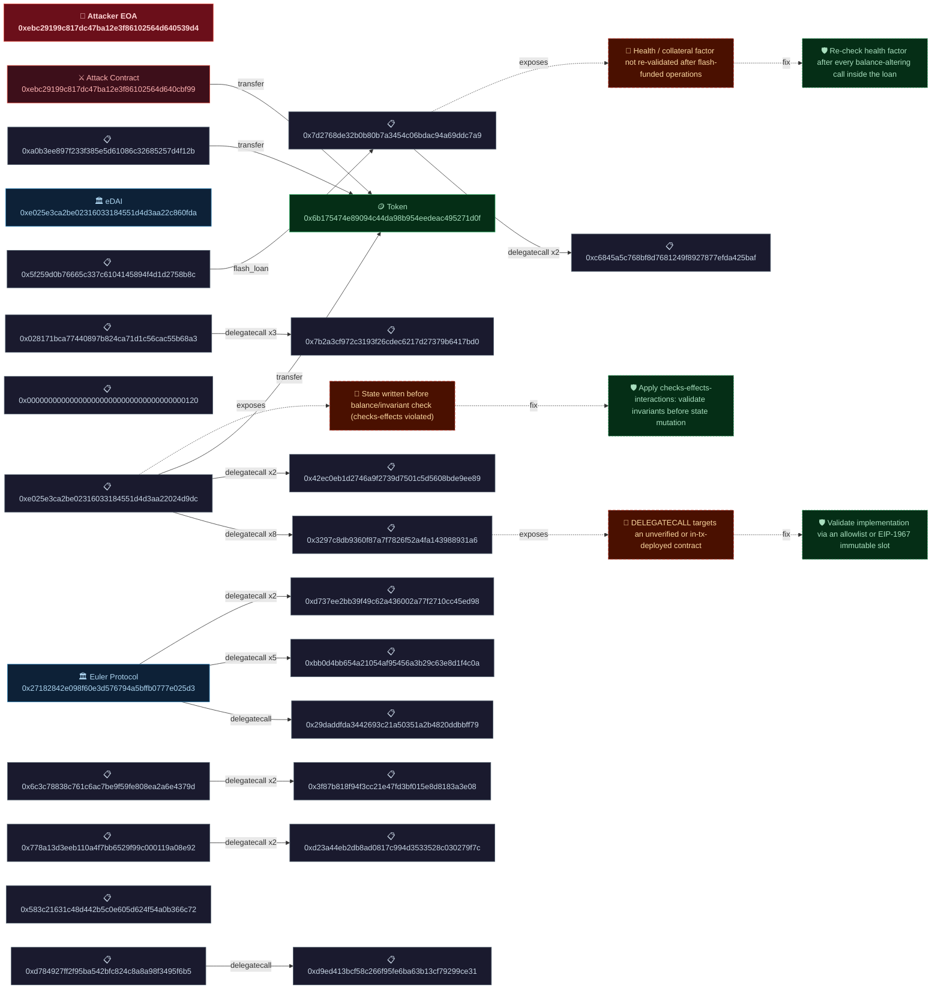

# Forensic Diagram — `0xc310a0af...111d`

- **Transaction:** `0xc310a0affe2169d1f6feec1c63dbc7f7c62a887fa48795d327d4d2da2d6b111d`
- **Attacker:** `0xeBC29199C817Dc47BA12E3F86102564D640539d4`
- **Target:** Euler Protocol `0x27182842E098f60e3D576794A5bFFb0777E025d3`
- **Target:** eDAI `0xe025E3ca2bE02316033184551D4d3Aa22c860fDA`
- **EVM Frames:** 89,623
- **Semantic Actions:** 139
- **Edges:** 138

### Action Breakdown

| Type | Count |
|------|-------|
| storage_write | 95 |
| delegate_call | 36 |
| token_transfer | 7 |
| flash_loan_borrow | 1 |

## Forensic Flowchart

## Sequence Diagram

```mermaid
sequenceDiagram
    participant 0xd9ed..ce31
    participant 0xd784..f6b5
    participant 0x583c..6c72
    participant 0xd23a..9f7c
    participant 0x778a..8e92
    participant 0x3f87..3e08
    participant 0x6c3c..379d
    participant 0xa0b3..f12b
    participant 0xe025..d9dc
    participant 0xd737..ed98
    participant 0x29da..ff79
    participant 0x3297..31a6
    participant 0x42ec..ee89
    participant 0xbb0d..4c0a
    participant 0x2718..25d3
    participant 0xebc2..bf99
    participant 0x0000..0120
    participant 0x6b17..1d0f
    participant 0x7b2a..7bd0
    participant 0x0281..68a3
    participant 0xc684..5baf
    participant 0x7d27..c7a9
    participant 0x5f25..8b8c
    0x5f25..8b8c->>+0x7d27..c7a9: flash_loan_borrow
    0x7d27..c7a9->>+0xc684..5baf: delegate_call
    0x0281..68a3->>+0x7b2a..7bd0: delegate_call
    unknown->>+0x6b17..1d0f: token_transfer
    0x6b17..1d0f->>+0x6b17..1d0f: storage_write
    0x6b17..1d0f->>+0x6b17..1d0f: storage_write
    0x6b17..1d0f->>+0x6b17..1d0f: storage_write
    0x0000..0120->>+0x0000..0120: storage_write
    0xebc2..bf99->>+0x6b17..1d0f: token_transfer
    0x6b17..1d0f->>+0x6b17..1d0f: storage_write
    0x6b17..1d0f->>+0x6b17..1d0f: storage_write
    0x6b17..1d0f->>+0x6b17..1d0f: storage_write
    0x2718..25d3->>+0xbb0d..4c0a: delegate_call
    unknown->>+unknown: storage_write
    unknown->>+unknown: storage_write
    unknown->>+unknown: storage_write
    unknown->>+unknown: storage_write
    unknown->>+unknown: storage_write
    unknown->>+0x6b17..1d0f: token_transfer
    0x6b17..1d0f->>+0x6b17..1d0f: storage_write
    0x6b17..1d0f->>+0x6b17..1d0f: storage_write
    unknown->>+unknown: storage_write
    unknown->>+unknown: storage_write
    unknown->>+0x42ec..ee89: delegate_call
    unknown->>+unknown: storage_write
    unknown->>+unknown: storage_write
    0x2718..25d3->>+0xbb0d..4c0a: delegate_call
    unknown->>+unknown: storage_write
    unknown->>+unknown: storage_write
    unknown->>+unknown: storage_write
    unknown->>+0x42ec..ee89: delegate_call
    unknown->>+unknown: storage_write
    unknown->>+unknown: storage_write
    unknown->>+unknown: storage_write
    unknown->>+unknown: storage_write
    unknown->>+unknown: storage_write
    unknown->>+unknown: storage_write
    unknown->>+unknown: storage_write
    unknown->>+0x42ec..ee89: delegate_call
    unknown->>+unknown: storage_write
    unknown->>+0x3297..31a6: delegate_call
    unknown->>+unknown: storage_write
    0x2718..25d3->>+0x29da..ff79: delegate_call
    unknown->>+unknown: storage_write
    unknown->>+0x6b17..1d0f: token_transfer
    0x6b17..1d0f->>+0x6b17..1d0f: storage_write
    0x6b17..1d0f->>+0x6b17..1d0f: storage_write
    unknown->>+unknown: storage_write
    unknown->>+unknown: storage_write
    unknown->>+unknown: storage_write
    unknown->>+unknown: storage_write
    unknown->>+0x42ec..ee89: delegate_call
    unknown->>+unknown: storage_write
    unknown->>+unknown: storage_write
    0x2718..25d3->>+0xbb0d..4c0a: delegate_call
    unknown->>+unknown: storage_write
    unknown->>+unknown: storage_write
    unknown->>+unknown: storage_write
    unknown->>+0x42ec..ee89: delegate_call
    unknown->>+unknown: storage_write
    unknown->>+unknown: storage_write
    unknown->>+unknown: storage_write
    unknown->>+unknown: storage_write
    unknown->>+unknown: storage_write
    unknown->>+0x42ec..ee89: delegate_call
    unknown->>+unknown: storage_write
    unknown->>+0x3297..31a6: delegate_call
    unknown->>+unknown: storage_write
    0x2718..25d3->>+0xbb0d..4c0a: delegate_call
    unknown->>+unknown: storage_write
    unknown->>+unknown: storage_write
    unknown->>+unknown: storage_write
    unknown->>+unknown: storage_write
    0x2718..25d3->>+0xd737..ed98: delegate_call
    0xe025..d9dc->>+0xe025..d9dc: storage_write
    0xe025..d9dc->>+0x3297..31a6: delegate_call
    0xe025..d9dc->>+0x3297..31a6: delegate_call
    0xe025..d9dc->>+0x3297..31a6: delegate_call
    0xe025..d9dc->>+0xe025..d9dc: storage_write
    0x2718..25d3->>+0xd737..ed98: delegate_call
    0xe025..d9dc->>+0xe025..d9dc: storage_write
    0xe025..d9dc->>+0x3297..31a6: delegate_call
    0xe025..d9dc->>+0x3297..31a6: delegate_call
    0xe025..d9dc->>+0x3297..31a6: delegate_call
    0xe025..d9dc->>+0xe025..d9dc: storage_write
    0xe025..d9dc->>+0xe025..d9dc: storage_write
    0xe025..d9dc->>+0xe025..d9dc: storage_write
    0xe025..d9dc->>+0xe025..d9dc: storage_write
    0xe025..d9dc->>+0xe025..d9dc: storage_write
    0xe025..d9dc->>+0xe025..d9dc: storage_write
    0xe025..d9dc->>+0xe025..d9dc: storage_write
    0xe025..d9dc->>+0xe025..d9dc: storage_write
    0xe025..d9dc->>+0xe025..d9dc: storage_write
    0xe025..d9dc->>+0xe025..d9dc: storage_write
    0xe025..d9dc->>+0xe025..d9dc: storage_write
    0xe025..d9dc->>+0xe025..d9dc: storage_write
    0xe025..d9dc->>+0x42ec..ee89: delegate_call
    0xe025..d9dc->>+0xe025..d9dc: storage_write
    0xe025..d9dc->>+0xe025..d9dc: storage_write
    0xe025..d9dc->>+0xe025..d9dc: storage_write
    0xe025..d9dc->>+0xe025..d9dc: storage_write
    0xe025..d9dc->>+0xe025..d9dc: storage_write
    0xe025..d9dc->>+0x3297..31a6: delegate_call
    0xe025..d9dc->>+0xe025..d9dc: storage_write
    0x2718..25d3->>+0xbb0d..4c0a: delegate_call
    0xe025..d9dc->>+0xe025..d9dc: storage_write
    0xe025..d9dc->>+0x6b17..1d0f: token_transfer
    0x6b17..1d0f->>+0x6b17..1d0f: storage_write
    0x6b17..1d0f->>+0x6b17..1d0f: storage_write
    0xe025..d9dc->>+0xe025..d9dc: storage_write
    0xe025..d9dc->>+0xe025..d9dc: storage_write
    0xe025..d9dc->>+0x42ec..ee89: delegate_call
    0xe025..d9dc->>+0xe025..d9dc: storage_write
    0xe025..d9dc->>+0x3297..31a6: delegate_call
    0xe025..d9dc->>+0xe025..d9dc: storage_write
    0xa0b3..f12b->>+0x6b17..1d0f: token_transfer
    0x6b17..1d0f->>+0x6b17..1d0f: storage_write
    0x6b17..1d0f->>+0x6b17..1d0f: storage_write
    0xebc2..bf99->>+0xebc2..bf99: storage_write
    0x6c3c..379d->>+0x3f87..3e08: delegate_call
    unknown->>+unknown: storage_write
    unknown->>+unknown: storage_write
    unknown->>+unknown: storage_write
    0x778a..8e92->>+0xd23a..9f7c: delegate_call
    0x0281..68a3->>+0x7b2a..7bd0: delegate_call
    0x583c..6c72->>+0x583c..6c72: storage_write
    0x583c..6c72->>+0x583c..6c72: storage_write
    0xd784..f6b5->>+0xd9ed..ce31: delegate_call
    0x6b17..1d0f->>+0x6b17..1d0f: storage_write
    0x0281..68a3->>+0x7b2a..7bd0: delegate_call
    0x7d27..c7a9->>+0xc684..5baf: delegate_call
    unknown->>+unknown: storage_write
    0x778a..8e92->>+0xd23a..9f7c: delegate_call
    0x6c3c..379d->>+0x3f87..3e08: delegate_call
    unknown->>+unknown: storage_write
    unknown->>+unknown: storage_write
    unknown->>+0x6b17..1d0f: token_transfer
    0x6b17..1d0f->>+0x6b17..1d0f: storage_write
    0x6b17..1d0f->>+0x6b17..1d0f: storage_write
```

## Security Findings

| Vulnerability | Recommended Fix |
|--------------|-----------------|
| Health / collateral factor not re-validated after flash-funded operations | Re-check health factor after every balance-altering call inside the loan |
| DELEGATECALL targets an unverified or in-tx-deployed contract | Validate implementation via an allowlist or EIP-1967 immutable slot |
| State written before balance/invariant check (checks-effects violated) | Apply checks-effects-interactions: validate invariants before state mutation |
