# Forensic Diagram — `0x0fe25420...1c92`

- **Transaction:** `0x0fe2542079644e107cbf13690eb9c2c65963ccb79089ff96bfaf8dced2331c92`
- **Attacker:** `0x24354D31bC9D90F62FE5f2454709C32049cf866b`
- **Target:** Cream Finance Comptroller (proxy) `0x3d5BC3c8d13dcB8bF317092d84783c2697AE9258`
- **EVM Frames:** 3,338
- **Semantic Actions:** 699
- **Edges:** 701

### Action Breakdown

| Type | Count |
|------|-------|
| delegate_call | 631 |
| token_transfer | 58 |
| eth_transfer | 6 |
| flash_loan_borrow | 2 |
| dex_swap | 2 |

## Forensic Flowchart

```mermaid
graph LR

    classDef attacker fill:#6b0f1a,stroke:#e74c3c,color:#ffd6d6,font-weight:bold
    classDef atk_ctr  fill:#3d0f1a,stroke:#e74c3c,color:#ffb3b3
    classDef protocol fill:#0d2137,stroke:#2980b9,color:#aed6f1
    classDef token    fill:#052e16,stroke:#27ae60,color:#a9dfbf
    classDef other    fill:#1a1a2e,stroke:#566573,color:#c8d6e5
    classDef vuln     fill:#4a1000,stroke:#cb4335,color:#fad7a0,stroke-dasharray:6 3
    classDef fix      fill:#052e16,stroke:#27ae60,color:#a9dfbf,stroke-dasharray:3 3

    N0["👤 Attacker EOA<br/>0x24354d31bc9d90f62fe5f2454709c32049cf866b"]
    N1["⚔ Attack Contract<br/>0x961d2b694d9097f35cfffa363ef98823928a330d"]
    N2["🏛 Cream Finance Comptroller (proxy)<br/>0x3d5bc3c8d13dcb8bf317092d84783c2697ae9258"]
    N3["🪙 Token<br/>0x6b175474e89094c44da98b954eedeac495271d0f"]
    N4["🪙 Token<br/>0xa0b86991c6218b36c1d19d4a2e9eb0ce3606eb48"]
    N5["📋 0x1eb4cf3a948e7d72a198fe073ccb8c7a948cd853"]
    N6["📋 0x3dfd23a6c5e8bbcfc9581d2e864a68feb6a076d3"]
    N7["📋 0x2847a5d7ce69790cb40471d454feb21a0be1f2e3"]
    N8["📋 0x5d3a536e4d6dbd6114cc1ead35777bab948e3643"]
    N9["📋 0xa035b9e130f2b1aedc733eefb1c67ba4c503491f"]
    N10["📋 0x16de59092dae5ccf4a1e6439d611fd0653f0bd01"]
    N11["📋 0xa2327a938febf5fec13bacfb16ae10ecbc4cbdcf"]
    N12["📋 0xf650c3d88d12db855b8bf7d11be6c55a4e07dcc9"]
    N13["📋 0x0000000000085d4780b73119b644ae5ecd22b376"]
    N14["📋 0xffc40f39806f1400d8278bfd33823705b5a4c196"]
    N15["📋 0x45f783cce6b7ff23b2ab2d70e416cdb7d6055f51"]
    N16["📋 0xd6ad7a6750a7593e092a9b218d66c0a814a3436e"]
    N17["📋 0x83f798e925bcd4017eb265844fddabb448f1707d"]
    N18["📋 0x73a052500105205d34daf004eab301916da8190f"]
    N19["📋 0x4b5bfd52124784745c1071dcb244c6688d2533d3"]
    N20["📋 0xa696a63cc78dffa1a63e9e50587c197387ff6c7e"]
    N21["📋 0xdf5e0e81dff6faf3a7e52ba697820c5e32d806a8"]
    N22["📋 0x0000000000000000000000000000000000000004"]
    N23["📋 0x4baa77013ccd6705ab0522853cb0e9d453579dd4"]
    N24["📋 0x1c8645bec146ae9a3489fc5821b69c9191577331"]
    N25["📋 0x02e795eec131246128346d17d2f564d7bf7c705b"]
    N26["📋 0xf701426b8126bc60530574cecdcb365d47973284"]
    N27["📋 0x7d2768de32b0b80b7a3454c06bdac94a69ddc7a9"]
    N28["📋 0xc6845a5c768bf8d7681249f8927877efda425baf"]
    N29["📋 0x030ba81f1c18d280636f32af80b9aad02cf0854e"]
    N30["📋 0x541dcd3f00bcd1a683cc73e1b2a8693b602201f4"]
    N31["📋 0xc02aaa39b223fe8d0a0e5c4f27ead9083c756cc2"]
    N32["📋 0xd06527d5e56a3495252a528c4987003b712860ee"]
    N33["📋 0xe592427a0aece92de3edee1f18e0157c05861564"]
    N34["📋 0x8ad599c3a0ff1de082011efddc58f1908eb6e6d8"]
    N35["📋 0x8038c01a0390a8c547446a0b2c18fc9aefecc10c"]
    N36["📋 0xbebc44782c7db0a1a60cb6fe97d0b483032ff1c7"]
    N37["📋 0x5bc25f649fc4e26069ddf4cf4010f9f706c23831"]
    N38["📋 0xa89bd606d5dadda60242e8dedeebc95c41ad8986"]
    N39["📋 0xee39e4a6820ffc4edaa80fd3b5a59788d515832b"]
    N40["📋 0xe449ca7d10b041255e7e989d158bee355d8f88d3"]
    N41["📋 0x05977619e19fbc2f94bde352a78353b54dd918df"]
    N42["📋 0xfa712ee4788c042e2b7bb55e6cb8ec569c4530c1"]
    N43["📋 0x989aeb4d175e16225e39e87d0d97a3360524ad80"]
    N44["📋 0xf403c135812408bfbe8713b5a23a04b3d48aae31"]
    N45["📋 0xa5189cb0149761a8346d64e384924b2394dfa595"]
    N46["📋 0xfd609a03b393f1a1cfcacedabf068cad09a924e2"]
    N47["📋 0x3c710b981f5ef28da1807ce7ed3f2a28580e0754"]
    N48["📋 0xcbc1065255cbc3ab41a6868c22d1f1c573ab89fd"]
    N49["📋 0x228619cca194fbe3ebeb2f835ec1ea5080dafbb2"]
    N50["📋 0xc9d8a3b9c39b71969280fc249c87b5d0cb77f3c9"]
    N51["📋 0x8798249c2e607446efb7ad49ec89dd1865ff4272"]
    N52["📋 0xeff039c3c1d668f408d09dd7b63008622a77532c"]
    N53["📋 0x0d438f3b5175bebc262bf23753c1e53d03432bde"]
    N54["📋 0x299e254a8a165bbeb76d9d69305013329eea3a3b"]
    N55["📋 0xbc396689893d065f41bc2c6ecbee5e0085233447"]
    N56["📋 0x8379baa817c5c5ab929b03ee8e3c48e45018ae41"]
    N57["📋 0x3155ba85d5f96b2d030a4966af206230e46849cb"]
    N58["📋 0x2a537fa9ffaea8c1a41d3c2b68a9cb791529366d"]
    N59["📋 0x1494ca1f11d487c2bbe4543e90080aeba4ba3c2b"]
    N60["📋 0xe89a6d0509faf730bd707bf868d9a2a744a363c7"]
    N61["📋 0x1f9840a85d5af5bf1d1762f925bdaddc4201f984"]
    N62["📋 0x44fbebd2f576670a6c33f6fc0b00aa8c5753b322"]
    N63["📋 0x8c3b7a4320ba70f8239f83770c4015b5bc4e6f91"]
    N64["📋 0x956f47f50a910163d8bf957cf5846d573e7f87ca"]
    N65["📋 0x797aab1ce7c01eb727ab980762ba88e7133d2157"]
    N66["📋 0xdac17f958d2ee523a2206206994597c13d831ec7"]
    N67["📋 0x1f9b4756b008106c806c7e64322d7ed3b72cb284"]
    N68["📋 0xdcd90c7f6324cfa40d7169ef80b12031770b4325"]
    N69["📋 0xe11ba472f74869176652c35d30db89854b5ae84d"]
    N70["📋 0xb8ffc3cd6e7cf5a098a1c92f48009765b24088dc"]
    N71["📋 0x2b33cf282f867a7ff693a66e11b0fcc5552e4425"]
    N72["📋 0xae7ab96520de3a18e5e111b5eaab095312d7fe84"]
    N73["📋 0x20dc62d5904633cc6a5e34bec87a048e80c92e97"]
    N74["📋 0x523effc8bfefc2948211a05a905f761cba5e8e9e"]
    N75["📋 0x6810e776880c02933d47db1b9fc05908e5386b96"]
    N76["📋 0x10fdbd1e48ee2fd9336a482d746138ae19e649db"]
    N77["📋 0x50d1c9771902476076ecfc8b2a83ad6b9355a4c9"]
    N78["📋 0x4112a717edd051f77d834a6703a1ef5e3d73387f"]
    N79["📋 0x25f8087ead173b73d6e8b84329989a8eea16cf73"]
    N80["📋 0xf63b34710400cad3e044cffdcab00a0f32e33ecf"]
    N81["📋 0xddde1fa049209bc24b69d5fa316a56efec918d79"]
    N82["📋 0x4e977830ba4bd783c0bb7f15d3e243f73ff57121"]
    N83["📋 0xa558ea1a875f8b576f0728d32c39f62158e49b92"]
    N84["📋 0xd784927ff2f95ba542bfc824c8a8a98f3495f6b5"]
    N85["📋 0x83d055d382f25e6793099713505c68a5c7535a35"]
    N86["📋 0x6c6bc977e13df9b0de53b251522280bb72383700"]

    V1["🚨 DELEGATECALL targets an unverified or in-tx-deployed contract"]
    F1["🛡 Validate implementation via an allowlist or EIP-1967 immutable slot"]
    V2["🚨 Health / collateral factor not re-validated after flash-funded operations"]
    F2["🛡 Re-check health factor after every balance-altering call inside the loan"]
    V3["🚨 Spot DEX price used directly as collateral oracle — manipulable in one tx"]
    F3["🛡 Replace with a TWAP oracle (≥ 30-minute window) or Chainlink price feed"]

    N22 -->|transfer| N19
    N22 -->|transfer| N21
    N13 -->|delegatecall x27| N14
    N29 -->|delegatecall x3| N30
    N76 -->|delegatecall x5| N47
    N76 -->|transfer| N77
    N10 -->|transfer x2| N3
    N5 -->|transfer| N3
    N67 -->|delegatecall x6| N24
    N67 -->|transfer| N68
    N49 -->|transfer| N51
    N49 -->|delegatecall x15| N50
    N54 -->|delegatecall x14| N47
    N54 -->|transfer| N55
    N58 -->|transfer| N59
    N58 -->|delegatecall x12| N47
    N2 -->|delegatecall x51| N25
    N2 -->|transfer x2| N19
    N2 -->|transfer| N31
    N6 -->|delegatecall x112| N7
    N78 -->|transfer| N79
    N78 -->|delegatecall x4| N47
    N62 -->|delegatecall x10| N47
    N62 -->|transfer| N4
    N15 -->|transfer x2| N10
    N15 -->|transfer x2| N18
    N15 -->|transfer x2| N17
    N15 -->|transfer x2| N16
    N19 -->|delegatecall x100| N20
    N23 -->|delegatecall x31| N24
    N23 -->|transfer x3| N19
    N82 -->|delegatecall x2| N83
    N74 -->|delegatecall x6| N47
    N74 -->|transfer| N75
    N8 -->|delegatecall x31| N9
    N86 -->|transfer| N3
    N65 -->|delegatecall x8| N47
    N65 -->|transfer| N66
    N27 -->|delegatecall x2| N28
    N35 -->|transfer x2| N22
    N35 -->|transfer| N37
    N35 -->|transfer| N4
    N56 -->|transfer| N57
    N56 -->|delegatecall x13| N47
    N34 -->|transfer| N4
    N63 -->|delegatecall x9| N47
    N63 -->|transfer| N64
    N1 -->|flash_loan| N5
    N1 -->|eth| N0
    N1 -->|eth, transfer| N31
    N1 -->|transfer| N21
    N43 -->|transfer| N21
    N4 -->|delegatecall x67| N11
    N4 -->|transfer| N31
    N45 -->|transfer| N21
    N38 -->|delegatecall| N39
    N72 -->|delegatecall x5| N73
    N70 -->|delegatecall x5| N71
    N36 -->|transfer| N22
    N36 -->|transfer| N4
    N31 -->|eth| N1
    N31 -->|eth| N26
    N32 -->|eth| N1
    N84 -->|delegatecall| N85
    N68 -->|delegatecall x18| N69
    N21 -->|transfer| N22
    N21 -->|transfer| N19
    N40 -->|delegatecall| N41
    N33 -->|dex_swap| N86
    N33 -->|dex_swap| N34
    N33 -->|transfer| N4
    N33 -->|transfer| N31
    N60 -->|transfer| N61
    N60 -->|delegatecall x11| N47
    N52 -->|transfer| N53
    N52 -->|delegatecall x15| N47
    N44 -->|transfer| N21
    N80 -->|delegatecall x2| N81
    N12 -->|delegatecall x27| N9
    N26 -->|transfer| N19
    N26 -->|transfer x2| N23
    N26 -->|flash_loan| N27
    N26 -->|transfer| N31
    N26 -->|eth| N32
    N42 -->|transfer| N21
    N46 -->|delegatecall x17| N47
    N46 -->|transfer| N48

    N47 -.->|exposes| V1
    V1 -.->|fix| F1
    N5 -.->|exposes| V2
    V2 -.->|fix| F2
    N34 -.->|exposes| V3
    V3 -.->|fix| F3

    class N0 attacker
    class N1 atk_ctr
    class N2 protocol
    class N3 token
    class N4 token
    class N5 other
    class N6 other
    class N7 other
    class N8 other
    class N9 other
    class N10 other
    class N11 other
    class N12 other
    class N13 other
    class N14 other
    class N15 other
    class N16 other
    class N17 other
    class N18 other
    class N19 other
    class N20 other
    class N21 other
    class N22 other
    class N23 other
    class N24 other
    class N25 other
    class N26 other
    class N27 other
    class N28 other
    class N29 other
    class N30 other
    class N31 other
    class N32 other
    class N33 other
    class N34 other
    class N35 other
    class N36 other
    class N37 other
    class N38 other
    class N39 other
    class N40 other
    class N41 other
    class N42 other
    class N43 other
    class N44 other
    class N45 other
    class N46 other
    class N47 other
    class N48 other
    class N49 other
    class N50 other
    class N51 other
    class N52 other
    class N53 other
    class N54 other
    class N55 other
    class N56 other
    class N57 other
    class N58 other
    class N59 other
    class N60 other
    class N61 other
    class N62 other
    class N63 other
    class N64 other
    class N65 other
    class N66 other
    class N67 other
    class N68 other
    class N69 other
    class N70 other
    class N71 other
    class N72 other
    class N73 other
    class N74 other
    class N75 other
    class N76 other
    class N77 other
    class N78 other
    class N79 other
    class N80 other
    class N81 other
    class N82 other
    class N83 other
    class N84 other
    class N85 other
    class N86 other
    class V1 vuln
    class F1 fix
    class V2 vuln
    class F2 fix
    class V3 vuln
    class F3 fix
```



## Sequence Diagram
```mermaid
sequenceDiagram
    participant 0x2435..866b
    participant 0x6c6b..3700
    participant 0x83d0..5a35
    participant 0xd784..f6b5
    participant 0xa558..9b92
    participant 0x4e97..7121
    participant 0xddde..8d79
    participant 0xf63b..3ecf
    participant 0x25f8..cf73
    participant 0x4112..387f
    participant 0x50d1..a4c9
    participant 0x10fd..49db
    participant 0x6810..6b96
    participant 0x523e..8e9e
    participant 0x20dc..2e97
    participant 0xae7a..fe84
    participant 0x2b33..4425
    participant 0xb8ff..88dc
    participant 0xe11b..e84d
    participant 0xdcd9..4325
    participant 0x1f9b..b284
    participant 0xdac1..1ec7
    participant 0x797a..2157
    participant 0x956f..87ca
    participant 0x8c3b..6f91
    participant 0x44fb..b322
    participant 0x1f98..f984
    participant 0xe89a..63c7
    participant 0x1494..3c2b
    participant 0x2a53..366d
    participant 0x3155..49cb
    participant 0x8379..ae41
    participant 0xbc39..3447
    participant 0x299e..3a3b
    participant 0x0d43..2bde
    participant 0xeff0..532c
    participant 0x8798..4272
    participant 0xc9d8..f3c9
    participant 0x2286..fbb2
    participant 0xcbc1..89fd
    participant 0x3c71..0754
    participant 0xfd60..24e2
    participant 0xa518..a595
    participant 0xf403..ae31
    participant 0x989a..ad80
    participant 0xfa71..30c1
    participant 0x0597..18df
    participant 0xe449..88d3
    participant 0xee39..832b
    participant 0xa89b..8986
    participant 0x5bc2..3831
    participant 0xbebc..f1c7
    participant 0x8038..c10c
    participant 0x8ad5..e6d8
    participant 0xe592..1564
    participant 0xd065..60ee
    participant 0xc02a..6cc2
    participant 0x541d..01f4
    participant 0x030b..854e
    participant 0xc684..5baf
    participant 0x7d27..c7a9
    participant 0xf701..3284
    participant 0x02e7..705b
    participant 0x3d5b..9258
    participant 0x1c86..7331
    participant 0x4baa..9dd4
    participant 0x0000..0004
    participant 0xdf5e..06a8
    participant 0xa696..6c7e
    participant 0x4b5b..33d3
    participant 0x73a0..190f
    participant 0x83f7..707d
    participant 0xd6ad..436e
    participant 0x45f7..5f51
    participant 0xffc4..c196
    participant 0x0000..b376
    participant 0xf650..dcc9
    participant 0xa232..bdcf
    participant 0xa0b8..eb48
    participant 0x6b17..1d0f
    participant 0x16de..bd01
    participant 0xa035..491f
    participant 0x5d3a..3643
    participant 0x2847..f2e3
    participant 0x3dfd..76d3
    participant 0x1eb4..d853
    participant 0x961d..330d
    0x961d..330d->>+0x1eb4..d853: flash_loan_borrow
    0x3dfd..76d3->>+0x2847..f2e3: delegate_call
    0x5d3a..3643->>+0xa035..491f: delegate_call
    0x16de..bd01->>+0x6b17..1d0f: token_transfer
    0x3dfd..76d3->>+0x2847..f2e3: delegate_call
    0x5d3a..3643->>+0xa035..491f: delegate_call
    0x3dfd..76d3->>+0x2847..f2e3: delegate_call
    0x5d3a..3643->>+0xa035..491f: delegate_call
    0xa0b8..eb48->>+0xa232..bdcf: delegate_call
    0x3dfd..76d3->>+0x2847..f2e3: delegate_call
    0x3dfd..76d3->>+0x2847..f2e3: delegate_call
    0xf650..dcc9->>+0xa035..491f: delegate_call
    0x0000..b376->>+0xffc4..c196: delegate_call
    0x3dfd..76d3->>+0x2847..f2e3: delegate_call
    0x45f7..5f51->>+0x16de..bd01: token_transfer
    0x45f7..5f51->>+0xd6ad..436e: token_transfer
    0x45f7..5f51->>+0x83f7..707d: token_transfer
    0x45f7..5f51->>+0x73a0..190f: token_transfer
    0x4b5b..33d3->>+0xa696..6c7e: delegate_call
    0xdf5e..06a8->>+0x0000..0004: token_transfer
    0xdf5e..06a8->>+0xdf5e..06a8: token_transfer
    0x4b5b..33d3->>+0xa696..6c7e: delegate_call
    0x4baa..9dd4->>+0x1c86..7331: delegate_call
    0x4b5b..33d3->>+0xa696..6c7e: delegate_call
    0x3d5b..9258->>+0x02e7..705b: delegate_call
    0x4b5b..33d3->>+0xa696..6c7e: delegate_call
    0x4b5b..33d3->>+0xa696..6c7e: delegate_call
    0xdf5e..06a8->>+0x4b5b..33d3: token_transfer
    0x4b5b..33d3->>+0xa696..6c7e: delegate_call
    0x4b5b..33d3->>+0xa696..6c7e: delegate_call
    0x3d5b..9258->>+0x02e7..705b: delegate_call
    0x3d5b..9258->>+0x02e7..705b: delegate_call
    0x3d5b..9258->>+0x02e7..705b: delegate_call
    0x4baa..9dd4->>+0x1c86..7331: delegate_call
    0x4b5b..33d3->>+0xa696..6c7e: delegate_call
    0x4b5b..33d3->>+0xa696..6c7e: delegate_call
    0x4b5b..33d3->>+0xa696..6c7e: delegate_call
    0x3dfd..76d3->>+0x2847..f2e3: delegate_call
    0x5d3a..3643->>+0xa035..491f: delegate_call
    0xa0b8..eb48->>+0xa232..bdcf: delegate_call
    0x3dfd..76d3->>+0x2847..f2e3: delegate_call
    0x3dfd..76d3->>+0x2847..f2e3: delegate_call
    0xf650..dcc9->>+0xa035..491f: delegate_call
    0x0000..b376->>+0xffc4..c196: delegate_call
    0x3dfd..76d3->>+0x2847..f2e3: delegate_call
    0xa0b8..eb48->>+0xa232..bdcf: delegate_call
    0xf701..3284->>+0x7d27..c7a9: flash_loan_borrow
    0x7d27..c7a9->>+0xc684..5baf: delegate_call
    0x030b..854e->>+0x541d..01f4: delegate_call
    0xa0b8..eb48->>+0xc02a..6cc2: token_transfer
    0xf701..3284->>+0xc02a..6cc2: token_transfer
    0xc02a..6cc2->>+0xf701..3284: eth_transfer
    0xf701..3284->>+0xd065..60ee: eth_transfer
    0x3d5b..9258->>+0x02e7..705b: delegate_call
    0x3d5b..9258->>+0x02e7..705b: delegate_call
    0x3d5b..9258->>+0x02e7..705b: delegate_call
    0x4b5b..33d3->>+0xa696..6c7e: delegate_call
    0x4baa..9dd4->>+0x1c86..7331: delegate_call
    0x3d5b..9258->>+0x02e7..705b: delegate_call
    0x4b5b..33d3->>+0xa696..6c7e: delegate_call
    0x4b5b..33d3->>+0xa696..6c7e: delegate_call
    0x3dfd..76d3->>+0x2847..f2e3: delegate_call
    0x5d3a..3643->>+0xa035..491f: delegate_call
    0xa0b8..eb48->>+0xa232..bdcf: delegate_call
    0x3dfd..76d3->>+0x2847..f2e3: delegate_call
    0x3dfd..76d3->>+0x2847..f2e3: delegate_call
    0xf650..dcc9->>+0xa035..491f: delegate_call
    0x0000..b376->>+0xffc4..c196: delegate_call
    0x3dfd..76d3->>+0x2847..f2e3: delegate_call
    0xa0b8..eb48->>+0xa232..bdcf: delegate_call
    0x4baa..9dd4->>+0x1c86..7331: delegate_call
    0x4b5b..33d3->>+0xa696..6c7e: delegate_call
    0x4b5b..33d3->>+0xa696..6c7e: delegate_call
    0x4b5b..33d3->>+0xa696..6c7e: delegate_call
    0x3dfd..76d3->>+0x2847..f2e3: delegate_call
    0x5d3a..3643->>+0xa035..491f: delegate_call
    0xa0b8..eb48->>+0xa232..bdcf: delegate_call
    0x3dfd..76d3->>+0x2847..f2e3: delegate_call
    0x3dfd..76d3->>+0x2847..f2e3: delegate_call
    0xf650..dcc9->>+0xa035..491f: delegate_call
    0x0000..b376->>+0xffc4..c196: delegate_call
    0x3dfd..76d3->>+0x2847..f2e3: delegate_call
    0xa0b8..eb48->>+0xa232..bdcf: delegate_call
    0x4b5b..33d3->>+0xa696..6c7e: delegate_call
    0x3d5b..9258->>+0x4b5b..33d3: token_transfer
    0x4b5b..33d3->>+0xa696..6c7e: delegate_call
    0x3d5b..9258->>+0x02e7..705b: delegate_call
    0x4b5b..33d3->>+0xa696..6c7e: delegate_call
    0x4baa..9dd4->>+0x1c86..7331: delegate_call
    0x3d5b..9258->>+0x02e7..705b: delegate_call
    0x4b5b..33d3->>+0xa696..6c7e: delegate_call
    0x4b5b..33d3->>+0xa696..6c7e: delegate_call
    0x3d5b..9258->>+0x4b5b..33d3: token_transfer
    0x4b5b..33d3->>+0xa696..6c7e: delegate_call
    0x4b5b..33d3->>+0xa696..6c7e: delegate_call
    0x3d5b..9258->>+0x02e7..705b: delegate_call
    0x4baa..9dd4->>+0x1c86..7331: delegate_call
    0xf701..3284->>+0x4baa..9dd4: token_transfer
    0x4baa..9dd4->>+0x1c86..7331: delegate_call
    0x3d5b..9258->>+0x02e7..705b: delegate_call
    0x4baa..9dd4->>+0x1c86..7331: delegate_call
    0x4b5b..33d3->>+0xa696..6c7e: delegate_call
    0x4b5b..33d3->>+0xa696..6c7e: delegate_call
    0x4b5b..33d3->>+0xa696..6c7e: delegate_call
    0x3dfd..76d3->>+0x2847..f2e3: delegate_call
    0x5d3a..3643->>+0xa035..491f: delegate_call
    0xa0b8..eb48->>+0xa232..bdcf: delegate_call
    0x3dfd..76d3->>+0x2847..f2e3: delegate_call
    0x3dfd..76d3->>+0x2847..f2e3: delegate_call
    0xf650..dcc9->>+0xa035..491f: delegate_call
    0x0000..b376->>+0xffc4..c196: delegate_call
    0x3dfd..76d3->>+0x2847..f2e3: delegate_call
    0xa0b8..eb48->>+0xa232..bdcf: delegate_call
    0x3d5b..9258->>+0x02e7..705b: delegate_call
    0x4baa..9dd4->>+0x1c86..7331: delegate_call
    0x3d5b..9258->>+0x02e7..705b: delegate_call
    0x4b5b..33d3->>+0xa696..6c7e: delegate_call
    0x4b5b..33d3->>+0xa696..6c7e: delegate_call
    0x3dfd..76d3->>+0x2847..f2e3: delegate_call
    0x5d3a..3643->>+0xa035..491f: delegate_call
    0xa0b8..eb48->>+0xa232..bdcf: delegate_call
    0x3dfd..76d3->>+0x2847..f2e3: delegate_call
    0x3dfd..76d3->>+0x2847..f2e3: delegate_call
    0xf650..dcc9->>+0xa035..491f: delegate_call
    0x0000..b376->>+0xffc4..c196: delegate_call
    0x3dfd..76d3->>+0x2847..f2e3: delegate_call
    0xa0b8..eb48->>+0xa232..bdcf: delegate_call
    0x4baa..9dd4->>+0x1c86..7331: delegate_call
    0x4b5b..33d3->>+0xa696..6c7e: delegate_call
    0x4b5b..33d3->>+0xa696..6c7e: delegate_call
    0x4b5b..33d3->>+0xa696..6c7e: delegate_call
    0x3dfd..76d3->>+0x2847..f2e3: delegate_call
    0x5d3a..3643->>+0xa035..491f: delegate_call
    0xa0b8..eb48->>+0xa232..bdcf: delegate_call
    0x3dfd..76d3->>+0x2847..f2e3: delegate_call
    0x3dfd..76d3->>+0x2847..f2e3: delegate_call
    0xf650..dcc9->>+0xa035..491f: delegate_call
    0x0000..b376->>+0xffc4..c196: delegate_call
    0x3dfd..76d3->>+0x2847..f2e3: delegate_call
    0xa0b8..eb48->>+0xa232..bdcf: delegate_call
    0x4b5b..33d3->>+0xa696..6c7e: delegate_call
    0x4baa..9dd4->>+0x4b5b..33d3: token_transfer
    0x4b5b..33d3->>+0xa696..6c7e: delegate_call
    0x3d5b..9258->>+0x02e7..705b: delegate_call
    0x4b5b..33d3->>+0xa696..6c7e: delegate_call
    0x4baa..9dd4->>+0x1c86..7331: delegate_call
    0x3d5b..9258->>+0x02e7..705b: delegate_call
    0x4b5b..33d3->>+0xa696..6c7e: delegate_call
    0x4b5b..33d3->>+0xa696..6c7e: delegate_call
    0x4baa..9dd4->>+0x4b5b..33d3: token_transfer
    0x4b5b..33d3->>+0xa696..6c7e: delegate_call
    0x4b5b..33d3->>+0xa696..6c7e: delegate_call
    0x3d5b..9258->>+0x02e7..705b: delegate_call
    0x4baa..9dd4->>+0x1c86..7331: delegate_call
    0xf701..3284->>+0x4baa..9dd4: token_transfer
    0x4baa..9dd4->>+0x1c86..7331: delegate_call
    0x3d5b..9258->>+0x02e7..705b: delegate_call
    0x4baa..9dd4->>+0x1c86..7331: delegate_call
    0x4b5b..33d3->>+0xa696..6c7e: delegate_call
    0x4b5b..33d3->>+0xa696..6c7e: delegate_call
    0x4b5b..33d3->>+0xa696..6c7e: delegate_call
    0x3dfd..76d3->>+0x2847..f2e3: delegate_call
    0x5d3a..3643->>+0xa035..491f: delegate_call
    0xa0b8..eb48->>+0xa232..bdcf: delegate_call
    0x3dfd..76d3->>+0x2847..f2e3: delegate_call
    0x3dfd..76d3->>+0x2847..f2e3: delegate_call
    0xf650..dcc9->>+0xa035..491f: delegate_call
    0x0000..b376->>+0xffc4..c196: delegate_call
    0x3dfd..76d3->>+0x2847..f2e3: delegate_call
    0xa0b8..eb48->>+0xa232..bdcf: delegate_call
    0x3d5b..9258->>+0x02e7..705b: delegate_call
    0x4baa..9dd4->>+0x1c86..7331: delegate_call
    0x3d5b..9258->>+0x02e7..705b: delegate_call
    0x4b5b..33d3->>+0xa696..6c7e: delegate_call
    0x4b5b..33d3->>+0xa696..6c7e: delegate_call
    0x3dfd..76d3->>+0x2847..f2e3: delegate_call
    0x5d3a..3643->>+0xa035..491f: delegate_call
    0xa0b8..eb48->>+0xa232..bdcf: delegate_call
    0x3dfd..76d3->>+0x2847..f2e3: delegate_call
    0x3dfd..76d3->>+0x2847..f2e3: delegate_call
    0xf650..dcc9->>+0xa035..491f: delegate_call
    0x0000..b376->>+0xffc4..c196: delegate_call
    0x3dfd..76d3->>+0x2847..f2e3: delegate_call
    0xa0b8..eb48->>+0xa232..bdcf: delegate_call
    0x4baa..9dd4->>+0x1c86..7331: delegate_call
    0x4b5b..33d3->>+0xa696..6c7e: delegate_call
    0x4b5b..33d3->>+0xa696..6c7e: delegate_call
    0x4b5b..33d3->>+0xa696..6c7e: delegate_call
    0x3dfd..76d3->>+0x2847..f2e3: delegate_call
    0x5d3a..3643->>+0xa035..491f: delegate_call
    0xa0b8..eb48->>+0xa232..bdcf: delegate_call
    0x3dfd..76d3->>+0x2847..f2e3: delegate_call
    0x3dfd..76d3->>+0x2847..f2e3: delegate_call
    0xf650..dcc9->>+0xa035..491f: delegate_call
    0x0000..b376->>+0xffc4..c196: delegate_call
    0x3dfd..76d3->>+0x2847..f2e3: delegate_call
    0xa0b8..eb48->>+0xa232..bdcf: delegate_call
    0x4b5b..33d3->>+0xa696..6c7e: delegate_call
    0x4baa..9dd4->>+0x4b5b..33d3: token_transfer
    0x4b5b..33d3->>+0xa696..6c7e: delegate_call
    0x3d5b..9258->>+0x02e7..705b: delegate_call
    0x4b5b..33d3->>+0xa696..6c7e: delegate_call
    0xf701..3284->>+0x4b5b..33d3: token_transfer
    0x4b5b..33d3->>+0xa696..6c7e: delegate_call
    0xe592..1564->>+0x8ad5..e6d8: dex_swap
    0x8ad5..e6d8->>+0xa0b8..eb48: token_transfer
    0xa0b8..eb48->>+0xa232..bdcf: delegate_call
    0xe592..1564->>+0xc02a..6cc2: token_transfer
    0x8038..c10c->>+0x0000..0004: token_transfer
    0x8038..c10c->>+0xa0b8..eb48: token_transfer
    0xa0b8..eb48->>+0xa232..bdcf: delegate_call
    0xbebc..f1c7->>+0x0000..0004: token_transfer
    0xbebc..f1c7->>+0xa0b8..eb48: token_transfer
    0xa0b8..eb48->>+0xa232..bdcf: delegate_call
    0x8038..c10c->>+0x0000..0004: token_transfer
    0x8038..c10c->>+0x5bc2..3831: token_transfer
    0xa89b..8986->>+0xee39..832b: delegate_call
    0xe449..88d3->>+0x0597..18df: delegate_call
    0x3dfd..76d3->>+0x2847..f2e3: delegate_call
    0x5d3a..3643->>+0xa035..491f: delegate_call
    0xa0b8..eb48->>+0xa232..bdcf: delegate_call
    0x3dfd..76d3->>+0x2847..f2e3: delegate_call
    0x3dfd..76d3->>+0x2847..f2e3: delegate_call
    0xf650..dcc9->>+0xa035..491f: delegate_call
    0x0000..b376->>+0xffc4..c196: delegate_call
    0x3dfd..76d3->>+0x2847..f2e3: delegate_call
    0x4b5b..33d3->>+0xa696..6c7e: delegate_call
    0x4b5b..33d3->>+0xa696..6c7e: delegate_call
    0x0000..0004->>+0x4b5b..33d3: token_transfer
    0x4b5b..33d3->>+0xa696..6c7e: delegate_call
    0x4b5b..33d3->>+0xa696..6c7e: delegate_call
    0xfa71..30c1->>+0xdf5e..06a8: token_transfer
    0x989a..ad80->>+0xdf5e..06a8: token_transfer
    0xf403..ae31->>+0xdf5e..06a8: token_transfer
    0xa518..a595->>+0xdf5e..06a8: token_transfer
    0x0000..0004->>+0x0000..0004: token_transfer
    0x0000..0004->>+0xdf5e..06a8: token_transfer
    0x4b5b..33d3->>+0xa696..6c7e: delegate_call
    0x961d..330d->>+0xdf5e..06a8: token_transfer
    0x3d5b..9258->>+0x02e7..705b: delegate_call
    0x4baa..9dd4->>+0x1c86..7331: delegate_call
    0x4b5b..33d3->>+0xa696..6c7e: delegate_call
    0x4b5b..33d3->>+0xa696..6c7e: delegate_call
    0x4b5b..33d3->>+0xa696..6c7e: delegate_call
    0x3dfd..76d3->>+0x2847..f2e3: delegate_call
    0x5d3a..3643->>+0xa035..491f: delegate_call
    0xa0b8..eb48->>+0xa232..bdcf: delegate_call
    0x3dfd..76d3->>+0x2847..f2e3: delegate_call
    0x3dfd..76d3->>+0x2847..f2e3: delegate_call
    0xf650..dcc9->>+0xa035..491f: delegate_call
    0x0000..b376->>+0xffc4..c196: delegate_call
    0x3dfd..76d3->>+0x2847..f2e3: delegate_call
    0xa0b8..eb48->>+0xa232..bdcf: delegate_call
    0xd065..60ee->>+0x961d..330d: eth_transfer
    0x3d5b..9258->>+0x02e7..705b: delegate_call
    0x961d..330d->>+0xc02a..6cc2: eth_transfer
    0x961d..330d->>+0xc02a..6cc2: token_transfer
    0xfd60..24e2->>+0x3c71..0754: delegate_call
    0xfd60..24e2->>+0x3c71..0754: delegate_call
    0x3d5b..9258->>+0x02e7..705b: delegate_call
    0xfd60..24e2->>+0x3c71..0754: delegate_call
    0x3d5b..9258->>+0x02e7..705b: delegate_call
    0x4baa..9dd4->>+0x1c86..7331: delegate_call
    0x4b5b..33d3->>+0xa696..6c7e: delegate_call
    0x4b5b..33d3->>+0xa696..6c7e: delegate_call
    0x4b5b..33d3->>+0xa696..6c7e: delegate_call
    0x3dfd..76d3->>+0x2847..f2e3: delegate_call
    0x5d3a..3643->>+0xa035..491f: delegate_call
    0xa0b8..eb48->>+0xa232..bdcf: delegate_call
    0x3dfd..76d3->>+0x2847..f2e3: delegate_call
    0x3dfd..76d3->>+0x2847..f2e3: delegate_call
    0xf650..dcc9->>+0xa035..491f: delegate_call
    0x0000..b376->>+0xffc4..c196: delegate_call
    0x3dfd..76d3->>+0x2847..f2e3: delegate_call
    0xa0b8..eb48->>+0xa232..bdcf: delegate_call
    0xfd60..24e2->>+0x3c71..0754: delegate_call
    0xfd60..24e2->>+0xcbc1..89fd: token_transfer
    0x2286..fbb2->>+0xc9d8..f3c9: delegate_call
    0x2286..fbb2->>+0xc9d8..f3c9: delegate_call
    0x3d5b..9258->>+0x02e7..705b: delegate_call
    0x4baa..9dd4->>+0x1c86..7331: delegate_call
    0x4b5b..33d3->>+0xa696..6c7e: delegate_call
    0x4b5b..33d3->>+0xa696..6c7e: delegate_call
    0x4b5b..33d3->>+0xa696..6c7e: delegate_call
    0x3dfd..76d3->>+0x2847..f2e3: delegate_call
    0x5d3a..3643->>+0xa035..491f: delegate_call
    0xa0b8..eb48->>+0xa232..bdcf: delegate_call
    0x3dfd..76d3->>+0x2847..f2e3: delegate_call
    0x3dfd..76d3->>+0x2847..f2e3: delegate_call
    0xf650..dcc9->>+0xa035..491f: delegate_call
    0x0000..b376->>+0xffc4..c196: delegate_call
    0x3dfd..76d3->>+0x2847..f2e3: delegate_call
    0xa0b8..eb48->>+0xa232..bdcf: delegate_call
    0xfd60..24e2->>+0x3c71..0754: delegate_call
    0x2286..fbb2->>+0xc9d8..f3c9: delegate_call
    0x2286..fbb2->>+0x8798..4272: token_transfer
    0x3d5b..9258->>+0x02e7..705b: delegate_call
    0xeff0..532c->>+0x3c71..0754: delegate_call
    0xeff0..532c->>+0x3c71..0754: delegate_call
    0x3d5b..9258->>+0x02e7..705b: delegate_call
    0xeff0..532c->>+0x3c71..0754: delegate_call
    0x3d5b..9258->>+0x02e7..705b: delegate_call
    0x4baa..9dd4->>+0x1c86..7331: delegate_call
    0x4b5b..33d3->>+0xa696..6c7e: delegate_call
    0x4b5b..33d3->>+0xa696..6c7e: delegate_call
    0x4b5b..33d3->>+0xa696..6c7e: delegate_call
    0x3dfd..76d3->>+0x2847..f2e3: delegate_call
    0x5d3a..3643->>+0xa035..491f: delegate_call
    0xa0b8..eb48->>+0xa232..bdcf: delegate_call
    0x3dfd..76d3->>+0x2847..f2e3: delegate_call
    0x3dfd..76d3->>+0x2847..f2e3: delegate_call
    0xf650..dcc9->>+0xa035..491f: delegate_call
    0x0000..b376->>+0xffc4..c196: delegate_call
    0x3dfd..76d3->>+0x2847..f2e3: delegate_call
    0xa0b8..eb48->>+0xa232..bdcf: delegate_call
    0xfd60..24e2->>+0x3c71..0754: delegate_call
    0x2286..fbb2->>+0xc9d8..f3c9: delegate_call
    0xeff0..532c->>+0x3c71..0754: delegate_call
    0xeff0..532c->>+0x0d43..2bde: token_transfer
    0x299e..3a3b->>+0x3c71..0754: delegate_call
    0x299e..3a3b->>+0x3c71..0754: delegate_call
    0x3d5b..9258->>+0x02e7..705b: delegate_call
    0x299e..3a3b->>+0x3c71..0754: delegate_call
    0x3d5b..9258->>+0x02e7..705b: delegate_call
    0x4baa..9dd4->>+0x1c86..7331: delegate_call
    0x4b5b..33d3->>+0xa696..6c7e: delegate_call
    0x4b5b..33d3->>+0xa696..6c7e: delegate_call
    0x4b5b..33d3->>+0xa696..6c7e: delegate_call
    0x3dfd..76d3->>+0x2847..f2e3: delegate_call
    0x5d3a..3643->>+0xa035..491f: delegate_call
    0xa0b8..eb48->>+0xa232..bdcf: delegate_call
    0x3dfd..76d3->>+0x2847..f2e3: delegate_call
    0x3dfd..76d3->>+0x2847..f2e3: delegate_call
    0xf650..dcc9->>+0xa035..491f: delegate_call
    0x0000..b376->>+0xffc4..c196: delegate_call
    0x3dfd..76d3->>+0x2847..f2e3: delegate_call
    0xa0b8..eb48->>+0xa232..bdcf: delegate_call
    0xfd60..24e2->>+0x3c71..0754: delegate_call
    0x2286..fbb2->>+0xc9d8..f3c9: delegate_call
    0xeff0..532c->>+0x3c71..0754: delegate_call
    0x299e..3a3b->>+0x3c71..0754: delegate_call
    0x299e..3a3b->>+0xbc39..3447: token_transfer
    0x8379..ae41->>+0x3c71..0754: delegate_call
    0x8379..ae41->>+0x3c71..0754: delegate_call
    0x3d5b..9258->>+0x02e7..705b: delegate_call
    0x8379..ae41->>+0x3c71..0754: delegate_call
    0x3d5b..9258->>+0x02e7..705b: delegate_call
    0x4baa..9dd4->>+0x1c86..7331: delegate_call
    0x4b5b..33d3->>+0xa696..6c7e: delegate_call
    0x4b5b..33d3->>+0xa696..6c7e: delegate_call
    0x4b5b..33d3->>+0xa696..6c7e: delegate_call
    0x3dfd..76d3->>+0x2847..f2e3: delegate_call
    0x5d3a..3643->>+0xa035..491f: delegate_call
    0xa0b8..eb48->>+0xa232..bdcf: delegate_call
    0x3dfd..76d3->>+0x2847..f2e3: delegate_call
    0x3dfd..76d3->>+0x2847..f2e3: delegate_call
    0xf650..dcc9->>+0xa035..491f: delegate_call
    0x0000..b376->>+0xffc4..c196: delegate_call
    0x3dfd..76d3->>+0x2847..f2e3: delegate_call
    0xa0b8..eb48->>+0xa232..bdcf: delegate_call
    0xfd60..24e2->>+0x3c71..0754: delegate_call
    0x2286..fbb2->>+0xc9d8..f3c9: delegate_call
    0xeff0..532c->>+0x3c71..0754: delegate_call
    0x299e..3a3b->>+0x3c71..0754: delegate_call
    0x8379..ae41->>+0x3c71..0754: delegate_call
    0x8379..ae41->>+0x3155..49cb: token_transfer
    0x2a53..366d->>+0x3c71..0754: delegate_call
    0x2a53..366d->>+0x3c71..0754: delegate_call
    0x3d5b..9258->>+0x02e7..705b: delegate_call
    0x2a53..366d->>+0x3c71..0754: delegate_call
    0x3d5b..9258->>+0x02e7..705b: delegate_call
    0x4baa..9dd4->>+0x1c86..7331: delegate_call
    0x4b5b..33d3->>+0xa696..6c7e: delegate_call
    0x4b5b..33d3->>+0xa696..6c7e: delegate_call
    0x4b5b..33d3->>+0xa696..6c7e: delegate_call
    0x3dfd..76d3->>+0x2847..f2e3: delegate_call
    0x5d3a..3643->>+0xa035..491f: delegate_call
    0xa0b8..eb48->>+0xa232..bdcf: delegate_call
    0x3dfd..76d3->>+0x2847..f2e3: delegate_call
    0x3dfd..76d3->>+0x2847..f2e3: delegate_call
    0xf650..dcc9->>+0xa035..491f: delegate_call
    0x0000..b376->>+0xffc4..c196: delegate_call
    0x3dfd..76d3->>+0x2847..f2e3: delegate_call
    0xa0b8..eb48->>+0xa232..bdcf: delegate_call
    0xfd60..24e2->>+0x3c71..0754: delegate_call
    0x2286..fbb2->>+0xc9d8..f3c9: delegate_call
    0xeff0..532c->>+0x3c71..0754: delegate_call
    0x299e..3a3b->>+0x3c71..0754: delegate_call
    0x8379..ae41->>+0x3c71..0754: delegate_call
    0x2a53..366d->>+0x3c71..0754: delegate_call
    0x2a53..366d->>+0x1494..3c2b: token_transfer
    0xe89a..63c7->>+0x3c71..0754: delegate_call
    0xe89a..63c7->>+0x3c71..0754: delegate_call
    0x3d5b..9258->>+0x02e7..705b: delegate_call
    0xe89a..63c7->>+0x3c71..0754: delegate_call
    0x3d5b..9258->>+0x02e7..705b: delegate_call
    0x4baa..9dd4->>+0x1c86..7331: delegate_call
    0x4b5b..33d3->>+0xa696..6c7e: delegate_call
    0x4b5b..33d3->>+0xa696..6c7e: delegate_call
    0x4b5b..33d3->>+0xa696..6c7e: delegate_call
    0x3dfd..76d3->>+0x2847..f2e3: delegate_call
    0x5d3a..3643->>+0xa035..491f: delegate_call
    0xa0b8..eb48->>+0xa232..bdcf: delegate_call
    0x3dfd..76d3->>+0x2847..f2e3: delegate_call
    0x3dfd..76d3->>+0x2847..f2e3: delegate_call
    0xf650..dcc9->>+0xa035..491f: delegate_call
    0x0000..b376->>+0xffc4..c196: delegate_call
    0x3dfd..76d3->>+0x2847..f2e3: delegate_call
    0xa0b8..eb48->>+0xa232..bdcf: delegate_call
    0xfd60..24e2->>+0x3c71..0754: delegate_call
    0x2286..fbb2->>+0xc9d8..f3c9: delegate_call
    0xeff0..532c->>+0x3c71..0754: delegate_call
    0x299e..3a3b->>+0x3c71..0754: delegate_call
    0x8379..ae41->>+0x3c71..0754: delegate_call
    0x2a53..366d->>+0x3c71..0754: delegate_call
    0xe89a..63c7->>+0x3c71..0754: delegate_call
    0xe89a..63c7->>+0x1f98..f984: token_transfer
    0x44fb..b322->>+0x3c71..0754: delegate_call
    0x44fb..b322->>+0x3c71..0754: delegate_call
    0x3d5b..9258->>+0x02e7..705b: delegate_call
    0x44fb..b322->>+0x3c71..0754: delegate_call
    0x3d5b..9258->>+0x02e7..705b: delegate_call
    0xa0b8..eb48->>+0xa232..bdcf: delegate_call
    0x4baa..9dd4->>+0x1c86..7331: delegate_call
    0x4b5b..33d3->>+0xa696..6c7e: delegate_call
    0x4b5b..33d3->>+0xa696..6c7e: delegate_call
    0x4b5b..33d3->>+0xa696..6c7e: delegate_call
    0x3dfd..76d3->>+0x2847..f2e3: delegate_call
    0x5d3a..3643->>+0xa035..491f: delegate_call
    0xa0b8..eb48->>+0xa232..bdcf: delegate_call
    0x3dfd..76d3->>+0x2847..f2e3: delegate_call
    0x3dfd..76d3->>+0x2847..f2e3: delegate_call
    0xf650..dcc9->>+0xa035..491f: delegate_call
    0x0000..b376->>+0xffc4..c196: delegate_call
    0x3dfd..76d3->>+0x2847..f2e3: delegate_call
    0xa0b8..eb48->>+0xa232..bdcf: delegate_call
    0xfd60..24e2->>+0x3c71..0754: delegate_call
    0x2286..fbb2->>+0xc9d8..f3c9: delegate_call
    0xeff0..532c->>+0x3c71..0754: delegate_call
    0x299e..3a3b->>+0x3c71..0754: delegate_call
    0x8379..ae41->>+0x3c71..0754: delegate_call
    0x2a53..366d->>+0x3c71..0754: delegate_call
    0xe89a..63c7->>+0x3c71..0754: delegate_call
    0x44fb..b322->>+0x3c71..0754: delegate_call
    0xa0b8..eb48->>+0xa232..bdcf: delegate_call
    0x44fb..b322->>+0xa0b8..eb48: token_transfer
    0xa0b8..eb48->>+0xa232..bdcf: delegate_call
    0x8c3b..6f91->>+0x3c71..0754: delegate_call
    0x8c3b..6f91->>+0x3c71..0754: delegate_call
    0x3d5b..9258->>+0x02e7..705b: delegate_call
    0x8c3b..6f91->>+0x3c71..0754: delegate_call
    0x3d5b..9258->>+0x02e7..705b: delegate_call
    0x4baa..9dd4->>+0x1c86..7331: delegate_call
    0x4b5b..33d3->>+0xa696..6c7e: delegate_call
    0x4b5b..33d3->>+0xa696..6c7e: delegate_call
    0x4b5b..33d3->>+0xa696..6c7e: delegate_call
    0x3dfd..76d3->>+0x2847..f2e3: delegate_call
    0x5d3a..3643->>+0xa035..491f: delegate_call
    0xa0b8..eb48->>+0xa232..bdcf: delegate_call
    0x3dfd..76d3->>+0x2847..f2e3: delegate_call
    0x3dfd..76d3->>+0x2847..f2e3: delegate_call
    0xf650..dcc9->>+0xa035..491f: delegate_call
    0x0000..b376->>+0xffc4..c196: delegate_call
    0x3dfd..76d3->>+0x2847..f2e3: delegate_call
    0xa0b8..eb48->>+0xa232..bdcf: delegate_call
    0xfd60..24e2->>+0x3c71..0754: delegate_call
    0x2286..fbb2->>+0xc9d8..f3c9: delegate_call
    0xeff0..532c->>+0x3c71..0754: delegate_call
    0x299e..3a3b->>+0x3c71..0754: delegate_call
    0x8379..ae41->>+0x3c71..0754: delegate_call
    0x2a53..366d->>+0x3c71..0754: delegate_call
    0xe89a..63c7->>+0x3c71..0754: delegate_call
    0x44fb..b322->>+0x3c71..0754: delegate_call
    0xa0b8..eb48->>+0xa232..bdcf: delegate_call
    0x8c3b..6f91->>+0x3c71..0754: delegate_call
    0x8c3b..6f91->>+0x956f..87ca: token_transfer
    0x797a..2157->>+0x3c71..0754: delegate_call
    0x797a..2157->>+0x3c71..0754: delegate_call
    0x3d5b..9258->>+0x02e7..705b: delegate_call
    0x797a..2157->>+0x3c71..0754: delegate_call
    0x3d5b..9258->>+0x02e7..705b: delegate_call
    0x4baa..9dd4->>+0x1c86..7331: delegate_call
    0x4b5b..33d3->>+0xa696..6c7e: delegate_call
    0x4b5b..33d3->>+0xa696..6c7e: delegate_call
    0x4b5b..33d3->>+0xa696..6c7e: delegate_call
    0x3dfd..76d3->>+0x2847..f2e3: delegate_call
    0x5d3a..3643->>+0xa035..491f: delegate_call
    0xa0b8..eb48->>+0xa232..bdcf: delegate_call
    0x3dfd..76d3->>+0x2847..f2e3: delegate_call
    0x3dfd..76d3->>+0x2847..f2e3: delegate_call
    0xf650..dcc9->>+0xa035..491f: delegate_call
    0x0000..b376->>+0xffc4..c196: delegate_call
    0x3dfd..76d3->>+0x2847..f2e3: delegate_call
    0xa0b8..eb48->>+0xa232..bdcf: delegate_call
    0xfd60..24e2->>+0x3c71..0754: delegate_call
    0x2286..fbb2->>+0xc9d8..f3c9: delegate_call
    0xeff0..532c->>+0x3c71..0754: delegate_call
    0x299e..3a3b->>+0x3c71..0754: delegate_call
    0x8379..ae41->>+0x3c71..0754: delegate_call
    0x2a53..366d->>+0x3c71..0754: delegate_call
    0xe89a..63c7->>+0x3c71..0754: delegate_call
    0x44fb..b322->>+0x3c71..0754: delegate_call
    0xa0b8..eb48->>+0xa232..bdcf: delegate_call
    0x8c3b..6f91->>+0x3c71..0754: delegate_call
    0x797a..2157->>+0x3c71..0754: delegate_call
    0x797a..2157->>+0xdac1..1ec7: token_transfer
    0x1f9b..b284->>+0x1c86..7331: delegate_call
    0xdcd9..4325->>+0xe11b..e84d: delegate_call
    0x1f9b..b284->>+0x1c86..7331: delegate_call
    0xdcd9..4325->>+0xe11b..e84d: delegate_call
    0x3d5b..9258->>+0x02e7..705b: delegate_call
    0xdcd9..4325->>+0xe11b..e84d: delegate_call
    0xdcd9..4325->>+0xe11b..e84d: delegate_call
    0xb8ff..88dc->>+0x2b33..4425: delegate_call
    0xae7a..fe84->>+0x20dc..2e97: delegate_call
    0x4baa..9dd4->>+0x1c86..7331: delegate_call
    0x4b5b..33d3->>+0xa696..6c7e: delegate_call
    0x4b5b..33d3->>+0xa696..6c7e: delegate_call
    0x4b5b..33d3->>+0xa696..6c7e: delegate_call
    0x3dfd..76d3->>+0x2847..f2e3: delegate_call
    0x5d3a..3643->>+0xa035..491f: delegate_call
    0xa0b8..eb48->>+0xa232..bdcf: delegate_call
    0x3dfd..76d3->>+0x2847..f2e3: delegate_call
    0x3dfd..76d3->>+0x2847..f2e3: delegate_call
    0xf650..dcc9->>+0xa035..491f: delegate_call
    0x0000..b376->>+0xffc4..c196: delegate_call
    0x3dfd..76d3->>+0x2847..f2e3: delegate_call
    0xa0b8..eb48->>+0xa232..bdcf: delegate_call
    0xfd60..24e2->>+0x3c71..0754: delegate_call
    0x2286..fbb2->>+0xc9d8..f3c9: delegate_call
    0xeff0..532c->>+0x3c71..0754: delegate_call
    0x299e..3a3b->>+0x3c71..0754: delegate_call
    0x8379..ae41->>+0x3c71..0754: delegate_call
    0x2a53..366d->>+0x3c71..0754: delegate_call
    0xe89a..63c7->>+0x3c71..0754: delegate_call
    0x44fb..b322->>+0x3c71..0754: delegate_call
    0xa0b8..eb48->>+0xa232..bdcf: delegate_call
    0x8c3b..6f91->>+0x3c71..0754: delegate_call
    0x797a..2157->>+0x3c71..0754: delegate_call
    0x1f9b..b284->>+0x1c86..7331: delegate_call
    0xdcd9..4325->>+0xe11b..e84d: delegate_call
    0xdcd9..4325->>+0xe11b..e84d: delegate_call
    0xdcd9..4325->>+0xe11b..e84d: delegate_call
    0xb8ff..88dc->>+0x2b33..4425: delegate_call
    0xae7a..fe84->>+0x20dc..2e97: delegate_call
    0xdcd9..4325->>+0xe11b..e84d: delegate_call
    0x1f9b..b284->>+0xdcd9..4325: token_transfer
    0xdcd9..4325->>+0xe11b..e84d: delegate_call
    0x3d5b..9258->>+0x02e7..705b: delegate_call
    0x523e..8e9e->>+0x3c71..0754: delegate_call
    0x523e..8e9e->>+0x3c71..0754: delegate_call
    0x3d5b..9258->>+0x02e7..705b: delegate_call
    0x523e..8e9e->>+0x3c71..0754: delegate_call
    0x3d5b..9258->>+0x02e7..705b: delegate_call
    0x4baa..9dd4->>+0x1c86..7331: delegate_call
    0x4b5b..33d3->>+0xa696..6c7e: delegate_call
    0x4b5b..33d3->>+0xa696..6c7e: delegate_call
    0x4b5b..33d3->>+0xa696..6c7e: delegate_call
    0x3dfd..76d3->>+0x2847..f2e3: delegate_call
    0x5d3a..3643->>+0xa035..491f: delegate_call
    0xa0b8..eb48->>+0xa232..bdcf: delegate_call
    0x3dfd..76d3->>+0x2847..f2e3: delegate_call
    0x3dfd..76d3->>+0x2847..f2e3: delegate_call
    0xf650..dcc9->>+0xa035..491f: delegate_call
    0x0000..b376->>+0xffc4..c196: delegate_call
    0x3dfd..76d3->>+0x2847..f2e3: delegate_call
    0xa0b8..eb48->>+0xa232..bdcf: delegate_call
    0xfd60..24e2->>+0x3c71..0754: delegate_call
    0x2286..fbb2->>+0xc9d8..f3c9: delegate_call
    0xeff0..532c->>+0x3c71..0754: delegate_call
    0x299e..3a3b->>+0x3c71..0754: delegate_call
    0x8379..ae41->>+0x3c71..0754: delegate_call
    0x2a53..366d->>+0x3c71..0754: delegate_call
    0xe89a..63c7->>+0x3c71..0754: delegate_call
    0x44fb..b322->>+0x3c71..0754: delegate_call
    0xa0b8..eb48->>+0xa232..bdcf: delegate_call
    0x8c3b..6f91->>+0x3c71..0754: delegate_call
    0x797a..2157->>+0x3c71..0754: delegate_call
    0x1f9b..b284->>+0x1c86..7331: delegate_call
    0xdcd9..4325->>+0xe11b..e84d: delegate_call
    0xdcd9..4325->>+0xe11b..e84d: delegate_call
    0xdcd9..4325->>+0xe11b..e84d: delegate_call
    0xb8ff..88dc->>+0x2b33..4425: delegate_call
    0xae7a..fe84->>+0x20dc..2e97: delegate_call
    0x523e..8e9e->>+0x3c71..0754: delegate_call
    0x523e..8e9e->>+0x6810..6b96: token_transfer
    0x10fd..49db->>+0x3c71..0754: delegate_call
    0x10fd..49db->>+0x3c71..0754: delegate_call
    0x3d5b..9258->>+0x02e7..705b: delegate_call
    0x10fd..49db->>+0x3c71..0754: delegate_call
    0x3d5b..9258->>+0x02e7..705b: delegate_call
    0x4baa..9dd4->>+0x1c86..7331: delegate_call
    0x4b5b..33d3->>+0xa696..6c7e: delegate_call
    0x4b5b..33d3->>+0xa696..6c7e: delegate_call
    0x4b5b..33d3->>+0xa696..6c7e: delegate_call
    0x3dfd..76d3->>+0x2847..f2e3: delegate_call
    0x5d3a..3643->>+0xa035..491f: delegate_call
    0xa0b8..eb48->>+0xa232..bdcf: delegate_call
    0x3dfd..76d3->>+0x2847..f2e3: delegate_call
    0x3dfd..76d3->>+0x2847..f2e3: delegate_call
    0xf650..dcc9->>+0xa035..491f: delegate_call
    0x0000..b376->>+0xffc4..c196: delegate_call
    0x3dfd..76d3->>+0x2847..f2e3: delegate_call
    0xa0b8..eb48->>+0xa232..bdcf: delegate_call
    0xfd60..24e2->>+0x3c71..0754: delegate_call
    0x2286..fbb2->>+0xc9d8..f3c9: delegate_call
    0xeff0..532c->>+0x3c71..0754: delegate_call
    0x299e..3a3b->>+0x3c71..0754: delegate_call
    0x8379..ae41->>+0x3c71..0754: delegate_call
    0x2a53..366d->>+0x3c71..0754: delegate_call
    0xe89a..63c7->>+0x3c71..0754: delegate_call
    0x44fb..b322->>+0x3c71..0754: delegate_call
    0xa0b8..eb48->>+0xa232..bdcf: delegate_call
    0x8c3b..6f91->>+0x3c71..0754: delegate_call
    0x797a..2157->>+0x3c71..0754: delegate_call
    0x1f9b..b284->>+0x1c86..7331: delegate_call
    0xdcd9..4325->>+0xe11b..e84d: delegate_call
    0xdcd9..4325->>+0xe11b..e84d: delegate_call
    0xdcd9..4325->>+0xe11b..e84d: delegate_call
    0xb8ff..88dc->>+0x2b33..4425: delegate_call
    0xae7a..fe84->>+0x20dc..2e97: delegate_call
    0x523e..8e9e->>+0x3c71..0754: delegate_call
    0x10fd..49db->>+0x3c71..0754: delegate_call
    0x10fd..49db->>+0x50d1..a4c9: token_transfer
    0x4112..387f->>+0x3c71..0754: delegate_call
    0x4112..387f->>+0x3c71..0754: delegate_call
    0x3d5b..9258->>+0x02e7..705b: delegate_call
    0x4112..387f->>+0x3c71..0754: delegate_call
    0x3d5b..9258->>+0x02e7..705b: delegate_call
    0x4baa..9dd4->>+0x1c86..7331: delegate_call
    0x4b5b..33d3->>+0xa696..6c7e: delegate_call
    0x4b5b..33d3->>+0xa696..6c7e: delegate_call
    0x4b5b..33d3->>+0xa696..6c7e: delegate_call
    0x3dfd..76d3->>+0x2847..f2e3: delegate_call
    0x5d3a..3643->>+0xa035..491f: delegate_call
    0xa0b8..eb48->>+0xa232..bdcf: delegate_call
    0x3dfd..76d3->>+0x2847..f2e3: delegate_call
    0x3dfd..76d3->>+0x2847..f2e3: delegate_call
    0xf650..dcc9->>+0xa035..491f: delegate_call
    0x0000..b376->>+0xffc4..c196: delegate_call
    0x3dfd..76d3->>+0x2847..f2e3: delegate_call
    0xa0b8..eb48->>+0xa232..bdcf: delegate_call
    0xfd60..24e2->>+0x3c71..0754: delegate_call
    0x2286..fbb2->>+0xc9d8..f3c9: delegate_call
    0xeff0..532c->>+0x3c71..0754: delegate_call
    0x299e..3a3b->>+0x3c71..0754: delegate_call
    0x8379..ae41->>+0x3c71..0754: delegate_call
    0x2a53..366d->>+0x3c71..0754: delegate_call
    0xe89a..63c7->>+0x3c71..0754: delegate_call
    0x44fb..b322->>+0x3c71..0754: delegate_call
    0xa0b8..eb48->>+0xa232..bdcf: delegate_call
    0x8c3b..6f91->>+0x3c71..0754: delegate_call
    0x797a..2157->>+0x3c71..0754: delegate_call
    0x1f9b..b284->>+0x1c86..7331: delegate_call
    0xdcd9..4325->>+0xe11b..e84d: delegate_call
    0xdcd9..4325->>+0xe11b..e84d: delegate_call
    0xdcd9..4325->>+0xe11b..e84d: delegate_call
    0xb8ff..88dc->>+0x2b33..4425: delegate_call
    0xae7a..fe84->>+0x20dc..2e97: delegate_call
    0x523e..8e9e->>+0x3c71..0754: delegate_call
    0x10fd..49db->>+0x3c71..0754: delegate_call
    0x4112..387f->>+0x3c71..0754: delegate_call
    0x4112..387f->>+0x25f8..cf73: token_transfer
    0xf63b..3ecf->>+0xddde..8d79: delegate_call
    0x4e97..7121->>+0xa558..9b92: delegate_call
    0x030b..854e->>+0x541d..01f4: delegate_call
    0xd784..f6b5->>+0x83d0..5a35: delegate_call
    0x030b..854e->>+0x541d..01f4: delegate_call
    0x7d27..c7a9->>+0xc684..5baf: delegate_call
    0x4e97..7121->>+0xa558..9b92: delegate_call
    0xf63b..3ecf->>+0xddde..8d79: delegate_call
    0x3d5b..9258->>+0xc02a..6cc2: token_transfer
    0x3dfd..76d3->>+0x2847..f2e3: delegate_call
    0x5d3a..3643->>+0xa035..491f: delegate_call
    0xa0b8..eb48->>+0xa232..bdcf: delegate_call
    0x3dfd..76d3->>+0x2847..f2e3: delegate_call
    0x3dfd..76d3->>+0x2847..f2e3: delegate_call
    0xf650..dcc9->>+0xa035..491f: delegate_call
    0x0000..b376->>+0xffc4..c196: delegate_call
    0x3dfd..76d3->>+0x2847..f2e3: delegate_call
    0x45f7..5f51->>+0x16de..bd01: token_transfer
    0x45f7..5f51->>+0xd6ad..436e: token_transfer
    0x45f7..5f51->>+0x83f7..707d: token_transfer
    0x45f7..5f51->>+0x73a0..190f: token_transfer
    0x3dfd..76d3->>+0x2847..f2e3: delegate_call
    0x5d3a..3643->>+0xa035..491f: delegate_call
    0x16de..bd01->>+0x6b17..1d0f: token_transfer
    0x3dfd..76d3->>+0x2847..f2e3: delegate_call
    0x5d3a..3643->>+0xa035..491f: delegate_call
    0xa0b8..eb48->>+0xa232..bdcf: delegate_call
    0xe592..1564->>+0x6c6b..3700: dex_swap
    0x6c6b..3700->>+0x6b17..1d0f: token_transfer
    0xa0b8..eb48->>+0xa232..bdcf: delegate_call
    0xe592..1564->>+0xa0b8..eb48: token_transfer
    0xa0b8..eb48->>+0xa232..bdcf: delegate_call
    0xa0b8..eb48->>+0xa232..bdcf: delegate_call
    0x1eb4..d853->>+0x6b17..1d0f: token_transfer
    0xc02a..6cc2->>+0x961d..330d: eth_transfer
    0x961d..330d->>+0x2435..866b: eth_transfer
```

## Security Findings

| Vulnerability | Recommended Fix |
|--------------|-----------------|
| Health / collateral factor not re-validated after flash-funded operations | Re-check health factor after every balance-altering call inside the loan |
| DELEGATECALL targets an unverified or in-tx-deployed contract | Validate implementation via an allowlist or EIP-1967 immutable slot |
| Spot DEX price used directly as collateral oracle — manipulable in one tx | Replace with a TWAP oracle (≥ 30-minute window) or Chainlink price feed |
