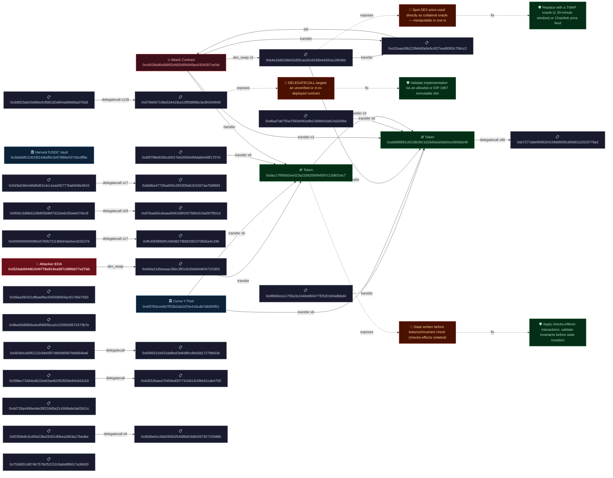

# Forensic Diagram — `0x35f8d2f5...0877`

- **Transaction:** `0x35f8d2f572fceaac9288e5d462117850ef2694786992a8c3f6d02612277b0877`
- **Attacker:** `0xf224ab004461540778a914ea397c589b677e27bb`
- **Target:** Harvest fUSDC Vault `0x3DA9D911301f8144bdF5c3c67886e5373DCdff8e`
- **Target:** Curve Y Pool `0x45F783CCE6B7FF23B2ab2D70e416cdb7D6055f51`
- **EVM Frames:** 1,097,126
- **Semantic Actions:** 554
- **Edges:** 554

### Action Breakdown

| Type | Count |
|------|-------|
| delegate_call | 292 |
| storage_write | 219 |
| token_transfer | 38 |
| dex_swap | 3 |
| eth_transfer | 2 |

## Forensic Flowchart



## Sequence Diagram
```mermaid
sequenceDiagram
    participant 0xc02a..6cc2
    participant 0x7538..8403
    participant 0x9b3b..588b
    participant 0xf035..edbe
    participant 0x4d72..b51c
    participant 0x986b..bbd4
    participant 0x6d25..4750
    participant 0x398e..d119
    participant 0x6085..61fe
    participant 0x082b..4ba6
    participant 0x9ba0..3b7e
    participant 0xd6ad..436e
    participant 0x83f7..707d
    participant 0x45f7..5f51
    participant 0x39aa..7563
    participant 0xb4e1..c9dc
    participant 0xc602..e0af
    participant 0xdac1..1ec7
    participant 0x0d4a..1852
    participant 0xffc4..c196
    participant 0x0000..b376
    participant 0x976a..001d
    participant 0xf650..dcc9
    participant 0xb727..78a2
    participant 0xa0b8..eb48
    participant 0xbb8b..96fd
    participant 0x5d3a..3643
    participant 0x5766..4948
    participant 0x3dfd..76d3
    participant 0xf224..27bb
    0xf224..27bb->>+0xf224..27bb: storage_write
    0xf224..27bb->>+0xf224..27bb: storage_write
    0x3dfd..76d3->>+0x5766..4948: delegate_call
    0x5d3a..3643->>+0xbb8b..96fd: delegate_call
    0xa0b8..eb48->>+0xb727..78a2: delegate_call
    0x3dfd..76d3->>+0x5766..4948: delegate_call
    0x3dfd..76d3->>+0x5766..4948: delegate_call
    0xf650..dcc9->>+0x976a..001d: delegate_call
    0x0000..b376->>+0xffc4..c196: delegate_call
    0x3dfd..76d3->>+0x5766..4948: delegate_call
    0xa0b8..eb48->>+0xb727..78a2: delegate_call
    0xa0b8..eb48->>+0xb727..78a2: delegate_call
    0xa0b8..eb48->>+0xb727..78a2: delegate_call
    0x3dfd..76d3->>+0x5766..4948: delegate_call
    0xf224..27bb->>+0xf224..27bb: storage_write
    0xf224..27bb->>+0x0d4a..1852: dex_swap
    0x0d4a..1852->>+0x0d4a..1852: storage_write
    0x0d4a..1852->>+0xdac1..1ec7: token_transfer
    0xdac1..1ec7->>+0xdac1..1ec7: storage_write
    0xdac1..1ec7->>+0xdac1..1ec7: storage_write
    0xc602..e0af->>+0xb4e1..c9dc: dex_swap
    0xb4e1..c9dc->>+0xb4e1..c9dc: storage_write
    0xb4e1..c9dc->>+0xa0b8..eb48: token_transfer
    0xa0b8..eb48->>+0xb727..78a2: delegate_call
    0x39aa..7563->>+0x39aa..7563: storage_write
    0x39aa..7563->>+0x39aa..7563: storage_write
    0x3dfd..76d3->>+0x5766..4948: delegate_call
    0x5d3a..3643->>+0xbb8b..96fd: delegate_call
    0xa0b8..eb48->>+0xb727..78a2: delegate_call
    0x3dfd..76d3->>+0x5766..4948: delegate_call
    0x3dfd..76d3->>+0x5766..4948: delegate_call
    0xf650..dcc9->>+0x976a..001d: delegate_call
    0x0000..b376->>+0xffc4..c196: delegate_call
    0x3dfd..76d3->>+0x5766..4948: delegate_call
    0xa0b8..eb48->>+0xb727..78a2: delegate_call
    0xa0b8..eb48->>+0xb727..78a2: delegate_call
    0xa0b8..eb48->>+0xb727..78a2: delegate_call
    0x3dfd..76d3->>+0x5766..4948: delegate_call
    0xa0b8..eb48->>+0xb727..78a2: delegate_call
    0x45f7..5f51->>+0x45f7..5f51: storage_write
    0x3dfd..76d3->>+0x5766..4948: delegate_call
    0x5d3a..3643->>+0xbb8b..96fd: delegate_call
    0xa0b8..eb48->>+0xb727..78a2: delegate_call
    0x3dfd..76d3->>+0x5766..4948: delegate_call
    0x3dfd..76d3->>+0x5766..4948: delegate_call
    0xf650..dcc9->>+0x976a..001d: delegate_call
    0x0000..b376->>+0xffc4..c196: delegate_call
    0x3dfd..76d3->>+0x5766..4948: delegate_call
    0x45f7..5f51->>+0x45f7..5f51: storage_write
    0x45f7..5f51->>+0x45f7..5f51: storage_write
    0x45f7..5f51->>+0xdac1..1ec7: token_transfer
    0xdac1..1ec7->>+0xdac1..1ec7: storage_write
    0xdac1..1ec7->>+0xdac1..1ec7: storage_write
    0xdac1..1ec7->>+0xdac1..1ec7: storage_write
    0x83f7..707d->>+0x83f7..707d: storage_write
    0x3dfd..76d3->>+0x5766..4948: delegate_call
    0xf650..dcc9->>+0x976a..001d: delegate_call
    0x83f7..707d->>+0x83f7..707d: storage_write
    0x83f7..707d->>+0xdac1..1ec7: token_transfer
    0xdac1..1ec7->>+0xdac1..1ec7: storage_write
    0xdac1..1ec7->>+0xdac1..1ec7: storage_write
    0xdac1..1ec7->>+0xdac1..1ec7: storage_write
    0x3dfd..76d3->>+0x5766..4948: delegate_call
    0xf650..dcc9->>+0x976a..001d: delegate_call
    0x83f7..707d->>+0x83f7..707d: storage_write
    0x83f7..707d->>+0x83f7..707d: storage_write
    0x83f7..707d->>+0x83f7..707d: storage_write
    0xd6ad..436e->>+0xd6ad..436e: storage_write
    0xa0b8..eb48->>+0xb727..78a2: delegate_call
    0x3dfd..76d3->>+0x5766..4948: delegate_call
    0xd6ad..436e->>+0xd6ad..436e: storage_write
    0xd6ad..436e->>+0xd6ad..436e: storage_write
    0xd6ad..436e->>+0xd6ad..436e: storage_write
    0xa0b8..eb48->>+0xb727..78a2: delegate_call
    0x3dfd..76d3->>+0x5766..4948: delegate_call
    0x3dfd..76d3->>+0x5766..4948: delegate_call
    0x9ba0..3b7e->>+0x9ba0..3b7e: storage_write
    0x9ba0..3b7e->>+0x9ba0..3b7e: storage_write
    0x3dfd..76d3->>+0x5766..4948: delegate_call
    0x9ba0..3b7e->>+0x9ba0..3b7e: storage_write
    0x082b..4ba6->>+0x6085..61fe: delegate_call
    0x3dfd..76d3->>+0x5766..4948: delegate_call
    0x3dfd..76d3->>+0x5766..4948: delegate_call
    0x3dfd..76d3->>+0x5766..4948: delegate_call
    0x3dfd..76d3->>+0x5766..4948: delegate_call
    0x3dfd..76d3->>+0x5766..4948: delegate_call
    0x3dfd..76d3->>+0x5766..4948: delegate_call
    0x3dfd..76d3->>+0x5766..4948: delegate_call
    0x3dfd..76d3->>+0x5766..4948: delegate_call
    0x3dfd..76d3->>+0x5766..4948: delegate_call
    0x3dfd..76d3->>+0x5766..4948: delegate_call
    0x3dfd..76d3->>+0x5766..4948: delegate_call
    0x3dfd..76d3->>+0x5766..4948: delegate_call
    0x3dfd..76d3->>+0x5766..4948: delegate_call
    0x3dfd..76d3->>+0x5766..4948: delegate_call
    0x3dfd..76d3->>+0x5766..4948: delegate_call
    0x3dfd..76d3->>+0x5766..4948: delegate_call
    0x3dfd..76d3->>+0x5766..4948: delegate_call
    0x3dfd..76d3->>+0x5766..4948: delegate_call
    0x3dfd..76d3->>+0x5766..4948: delegate_call
    0x3dfd..76d3->>+0x5766..4948: delegate_call
    0x3dfd..76d3->>+0x5766..4948: delegate_call
    0x3dfd..76d3->>+0x5766..4948: delegate_call
    0x3dfd..76d3->>+0x5766..4948: delegate_call
    0x3dfd..76d3->>+0x5766..4948: delegate_call
    0x3dfd..76d3->>+0x5766..4948: delegate_call
    0x3dfd..76d3->>+0x5766..4948: delegate_call
    0x9ba0..3b7e->>+0x9ba0..3b7e: storage_write
    0x9ba0..3b7e->>+0x9ba0..3b7e: storage_write
    0x398e..d119->>+0x6d25..4750: delegate_call
    0x39aa..7563->>+0x39aa..7563: storage_write
    0x3dfd..76d3->>+0x5766..4948: delegate_call
    0x3dfd..76d3->>+0x5766..4948: delegate_call
    0x3dfd..76d3->>+0x5766..4948: delegate_call
    0xa0b8..eb48->>+0xb727..78a2: delegate_call
    0x3dfd..76d3->>+0x5766..4948: delegate_call
    0x986b..bbd4->>+0x986b..bbd4: storage_write
    0x986b..bbd4->>+0x986b..bbd4: storage_write
    0xa0b8..eb48->>+0xb727..78a2: delegate_call
    0x986b..bbd4->>+0x986b..bbd4: storage_write
    0x986b..bbd4->>+0x986b..bbd4: storage_write
    0x986b..bbd4->>+0x986b..bbd4: storage_write
    0x986b..bbd4->>+0x986b..bbd4: storage_write
    0x3dfd..76d3->>+0x5766..4948: delegate_call
    0x986b..bbd4->>+0xa0b8..eb48: token_transfer
    0xa0b8..eb48->>+0xb727..78a2: delegate_call
    0x4d72..b51c->>+0x4d72..b51c: storage_write
    0x4d72..b51c->>+0x4d72..b51c: storage_write
    0xd6ad..436e->>+0xa0b8..eb48: token_transfer
    0xa0b8..eb48->>+0xb727..78a2: delegate_call
    0x398e..d119->>+0x398e..d119: storage_write
    0x398e..d119->>+0x398e..d119: storage_write
    0xa0b8..eb48->>+0xb727..78a2: delegate_call
    0x3dfd..76d3->>+0x5766..4948: delegate_call
    0xd6ad..436e->>+0xd6ad..436e: storage_write
    0xa0b8..eb48->>+0xb727..78a2: delegate_call
    0x45f7..5f51->>+0xa0b8..eb48: token_transfer
    0xa0b8..eb48->>+0xb727..78a2: delegate_call
    0x39aa..7563->>+0x39aa..7563: storage_write
    0x39aa..7563->>+0x39aa..7563: storage_write
    0x45f7..5f51->>+0x45f7..5f51: storage_write
    0xa0b8..eb48->>+0xb727..78a2: delegate_call
    0xf035..edbe->>+0x9b3b..588b: delegate_call
    0x3dfd..76d3->>+0x5766..4948: delegate_call
    0x5d3a..3643->>+0xbb8b..96fd: delegate_call
    0xa0b8..eb48->>+0xb727..78a2: delegate_call
    0x3dfd..76d3->>+0x5766..4948: delegate_call
    0x3dfd..76d3->>+0x5766..4948: delegate_call
    0xf650..dcc9->>+0x976a..001d: delegate_call
    0x0000..b376->>+0xffc4..c196: delegate_call
    0x3dfd..76d3->>+0x5766..4948: delegate_call
    0x3dfd..76d3->>+0x5766..4948: delegate_call
    0x5d3a..3643->>+0xbb8b..96fd: delegate_call
    0xa0b8..eb48->>+0xb727..78a2: delegate_call
    0x3dfd..76d3->>+0x5766..4948: delegate_call
    0x3dfd..76d3->>+0x5766..4948: delegate_call
    0xf650..dcc9->>+0x976a..001d: delegate_call
    0x0000..b376->>+0xffc4..c196: delegate_call
    0x3dfd..76d3->>+0x5766..4948: delegate_call
    0xa0b8..eb48->>+0xb727..78a2: delegate_call
    0xa0b8..eb48->>+0xb727..78a2: delegate_call
    0xa0b8..eb48->>+0xa0b8..eb48: storage_write
    0xa0b8..eb48->>+0xa0b8..eb48: storage_write
    0xa0b8..eb48->>+0xa0b8..eb48: token_transfer
    0xa0b8..eb48->>+0xb727..78a2: delegate_call
    0xa0b8..eb48->>+0xa0b8..eb48: storage_write
    0xa0b8..eb48->>+0xa0b8..eb48: storage_write
    0xa0b8..eb48->>+0xa0b8..eb48: storage_write
    0x45f7..5f51->>+0x45f7..5f51: storage_write
    0x3dfd..76d3->>+0x5766..4948: delegate_call
    0x5d3a..3643->>+0xbb8b..96fd: delegate_call
    0xa0b8..eb48->>+0xb727..78a2: delegate_call
    0x3dfd..76d3->>+0x5766..4948: delegate_call
    0x3dfd..76d3->>+0x5766..4948: delegate_call
    0xf650..dcc9->>+0x976a..001d: delegate_call
    0x0000..b376->>+0xffc4..c196: delegate_call
    0x3dfd..76d3->>+0x5766..4948: delegate_call
    0x45f7..5f51->>+0x45f7..5f51: storage_write
    0x45f7..5f51->>+0x45f7..5f51: storage_write
    0x45f7..5f51->>+0xa0b8..eb48: token_transfer
    0xa0b8..eb48->>+0xb727..78a2: delegate_call
    0x39aa..7563->>+0x39aa..7563: storage_write
    0x39aa..7563->>+0x39aa..7563: storage_write
    0x39aa..7563->>+0x39aa..7563: storage_write
    0xa0b8..eb48->>+0xb727..78a2: delegate_call
    0x39aa..7563->>+0x39aa..7563: storage_write
    0xd6ad..436e->>+0xd6ad..436e: storage_write
    0xa0b8..eb48->>+0xb727..78a2: delegate_call
    0x3dfd..76d3->>+0x5766..4948: delegate_call
    0xd6ad..436e->>+0xd6ad..436e: storage_write
    0xd6ad..436e->>+0xa0b8..eb48: token_transfer
    0xa0b8..eb48->>+0xb727..78a2: delegate_call
    0x7538..8403->>+0x7538..8403: storage_write
    0x7538..8403->>+0x7538..8403: storage_write
    0x7538..8403->>+0x7538..8403: storage_write
    0xa0b8..eb48->>+0xb727..78a2: delegate_call
    0x3dfd..76d3->>+0x5766..4948: delegate_call
    0xd6ad..436e->>+0xd6ad..436e: storage_write
    0xd6ad..436e->>+0xd6ad..436e: storage_write
    0xd6ad..436e->>+0xd6ad..436e: storage_write
    0x83f7..707d->>+0x83f7..707d: storage_write
    0x3dfd..76d3->>+0x5766..4948: delegate_call
    0xf650..dcc9->>+0x976a..001d: delegate_call
    0x83f7..707d->>+0x83f7..707d: storage_write
    0x83f7..707d->>+0x83f7..707d: storage_write
    0x83f7..707d->>+0x83f7..707d: storage_write
    0x83f7..707d->>+0xdac1..1ec7: token_transfer
    0xdac1..1ec7->>+0xdac1..1ec7: storage_write
    0xdac1..1ec7->>+0xdac1..1ec7: storage_write
    0x3dfd..76d3->>+0x5766..4948: delegate_call
    0xf650..dcc9->>+0x976a..001d: delegate_call
    0x83f7..707d->>+0x83f7..707d: storage_write
    0x45f7..5f51->>+0xdac1..1ec7: token_transfer
    0xdac1..1ec7->>+0xdac1..1ec7: storage_write
    0xdac1..1ec7->>+0xdac1..1ec7: storage_write
    0x45f7..5f51->>+0x45f7..5f51: storage_write
    0xf035..edbe->>+0x9b3b..588b: delegate_call
    0xf035..edbe->>+0x9b3b..588b: delegate_call
    0xdac1..1ec7->>+0xdac1..1ec7: storage_write
    0xdac1..1ec7->>+0xdac1..1ec7: storage_write
    0x3dfd..76d3->>+0x5766..4948: delegate_call
    0x5d3a..3643->>+0xbb8b..96fd: delegate_call
    0xa0b8..eb48->>+0xb727..78a2: delegate_call
    0x3dfd..76d3->>+0x5766..4948: delegate_call
    0x3dfd..76d3->>+0x5766..4948: delegate_call
    0xf650..dcc9->>+0x976a..001d: delegate_call
    0x0000..b376->>+0xffc4..c196: delegate_call
    0x3dfd..76d3->>+0x5766..4948: delegate_call
    0xa0b8..eb48->>+0xb727..78a2: delegate_call
    0xa0b8..eb48->>+0xb727..78a2: delegate_call
    0xa0b8..eb48->>+0xb727..78a2: delegate_call
    0xdac1..1ec7->>+0xa0b8..eb48: token_transfer
    0xa0b8..eb48->>+0xb727..78a2: delegate_call
    0xa0b8..eb48->>+0xa0b8..eb48: storage_write
    0xa0b8..eb48->>+0xa0b8..eb48: storage_write
    0x45f7..5f51->>+0x45f7..5f51: storage_write
    0x3dfd..76d3->>+0x5766..4948: delegate_call
    0x5d3a..3643->>+0xbb8b..96fd: delegate_call
    0xa0b8..eb48->>+0xb727..78a2: delegate_call
    0x3dfd..76d3->>+0x5766..4948: delegate_call
    0x3dfd..76d3->>+0x5766..4948: delegate_call
    0xf650..dcc9->>+0x976a..001d: delegate_call
    0x0000..b376->>+0xffc4..c196: delegate_call
    0x3dfd..76d3->>+0x5766..4948: delegate_call
    0x45f7..5f51->>+0x45f7..5f51: storage_write
    0x45f7..5f51->>+0x45f7..5f51: storage_write
    0x45f7..5f51->>+0xdac1..1ec7: token_transfer
    0xdac1..1ec7->>+0xdac1..1ec7: storage_write
    0xdac1..1ec7->>+0xdac1..1ec7: storage_write
    0xdac1..1ec7->>+0xdac1..1ec7: storage_write
    0x83f7..707d->>+0x83f7..707d: storage_write
    0x3dfd..76d3->>+0x5766..4948: delegate_call
    0xf650..dcc9->>+0x976a..001d: delegate_call
    0x83f7..707d->>+0x83f7..707d: storage_write
    0x83f7..707d->>+0xdac1..1ec7: token_transfer
    0xdac1..1ec7->>+0xdac1..1ec7: storage_write
    0xdac1..1ec7->>+0xdac1..1ec7: storage_write
    0xdac1..1ec7->>+0xdac1..1ec7: storage_write
    0x3dfd..76d3->>+0x5766..4948: delegate_call
    0xf650..dcc9->>+0x976a..001d: delegate_call
    0x83f7..707d->>+0x83f7..707d: storage_write
    0x83f7..707d->>+0x83f7..707d: storage_write
    0x83f7..707d->>+0x83f7..707d: storage_write
    0xd6ad..436e->>+0xd6ad..436e: storage_write
    0xa0b8..eb48->>+0xb727..78a2: delegate_call
    0x3dfd..76d3->>+0x5766..4948: delegate_call
    0xd6ad..436e->>+0xd6ad..436e: storage_write
    0xd6ad..436e->>+0xd6ad..436e: storage_write
    0xd6ad..436e->>+0xd6ad..436e: storage_write
    0xa0b8..eb48->>+0xb727..78a2: delegate_call
    0xd6ad..436e->>+0xa0b8..eb48: token_transfer
    0xa0b8..eb48->>+0xb727..78a2: delegate_call
    0x7538..8403->>+0x7538..8403: storage_write
    0x7538..8403->>+0x7538..8403: storage_write
    0xa0b8..eb48->>+0xb727..78a2: delegate_call
    0x3dfd..76d3->>+0x5766..4948: delegate_call
    0xd6ad..436e->>+0xd6ad..436e: storage_write
    0xa0b8..eb48->>+0xb727..78a2: delegate_call
    0x45f7..5f51->>+0xa0b8..eb48: token_transfer
    0xa0b8..eb48->>+0xb727..78a2: delegate_call
    0x39aa..7563->>+0x39aa..7563: storage_write
    0x39aa..7563->>+0x39aa..7563: storage_write
    0x45f7..5f51->>+0x45f7..5f51: storage_write
    0xa0b8..eb48->>+0xb727..78a2: delegate_call
    0xf035..edbe->>+0x9b3b..588b: delegate_call
    0x3dfd..76d3->>+0x5766..4948: delegate_call
    0x5d3a..3643->>+0xbb8b..96fd: delegate_call
    0xa0b8..eb48->>+0xb727..78a2: delegate_call
    0x3dfd..76d3->>+0x5766..4948: delegate_call
    0x3dfd..76d3->>+0x5766..4948: delegate_call
    0xf650..dcc9->>+0x976a..001d: delegate_call
    0x0000..b376->>+0xffc4..c196: delegate_call
    0x3dfd..76d3->>+0x5766..4948: delegate_call
    0x3dfd..76d3->>+0x5766..4948: delegate_call
    0x5d3a..3643->>+0xbb8b..96fd: delegate_call
    0xa0b8..eb48->>+0xb727..78a2: delegate_call
    0x3dfd..76d3->>+0x5766..4948: delegate_call
    0x3dfd..76d3->>+0x5766..4948: delegate_call
    0xf650..dcc9->>+0x976a..001d: delegate_call
    0x0000..b376->>+0xffc4..c196: delegate_call
    0x3dfd..76d3->>+0x5766..4948: delegate_call
    0xa0b8..eb48->>+0xb727..78a2: delegate_call
    0xa0b8..eb48->>+0xb727..78a2: delegate_call
    0xa0b8..eb48->>+0xa0b8..eb48: storage_write
    0xa0b8..eb48->>+0xa0b8..eb48: storage_write
    0xa0b8..eb48->>+0xa0b8..eb48: token_transfer
    0xa0b8..eb48->>+0xb727..78a2: delegate_call
    0xa0b8..eb48->>+0xa0b8..eb48: storage_write
    0xa0b8..eb48->>+0xa0b8..eb48: storage_write
    0xa0b8..eb48->>+0xa0b8..eb48: storage_write
    0x45f7..5f51->>+0x45f7..5f51: storage_write
    0x3dfd..76d3->>+0x5766..4948: delegate_call
    0x5d3a..3643->>+0xbb8b..96fd: delegate_call
    0xa0b8..eb48->>+0xb727..78a2: delegate_call
    0x3dfd..76d3->>+0x5766..4948: delegate_call
    0x3dfd..76d3->>+0x5766..4948: delegate_call
    0xf650..dcc9->>+0x976a..001d: delegate_call
    0x0000..b376->>+0xffc4..c196: delegate_call
    0x3dfd..76d3->>+0x5766..4948: delegate_call
    0x45f7..5f51->>+0x45f7..5f51: storage_write
    0x45f7..5f51->>+0x45f7..5f51: storage_write
    0x45f7..5f51->>+0xa0b8..eb48: token_transfer
    0xa0b8..eb48->>+0xb727..78a2: delegate_call
    0x39aa..7563->>+0x39aa..7563: storage_write
    0x39aa..7563->>+0x39aa..7563: storage_write
    0x39aa..7563->>+0x39aa..7563: storage_write
    0xa0b8..eb48->>+0xb727..78a2: delegate_call
    0x39aa..7563->>+0x39aa..7563: storage_write
    0xd6ad..436e->>+0xd6ad..436e: storage_write
    0xa0b8..eb48->>+0xb727..78a2: delegate_call
    0x3dfd..76d3->>+0x5766..4948: delegate_call
    0xd6ad..436e->>+0xd6ad..436e: storage_write
    0xd6ad..436e->>+0xa0b8..eb48: token_transfer
    0xa0b8..eb48->>+0xb727..78a2: delegate_call
    0x7538..8403->>+0x7538..8403: storage_write
    0x7538..8403->>+0x7538..8403: storage_write
    0x7538..8403->>+0x7538..8403: storage_write
    0xa0b8..eb48->>+0xb727..78a2: delegate_call
    0x3dfd..76d3->>+0x5766..4948: delegate_call
    0xd6ad..436e->>+0xd6ad..436e: storage_write
    0xd6ad..436e->>+0xd6ad..436e: storage_write
    0xd6ad..436e->>+0xd6ad..436e: storage_write
    0x83f7..707d->>+0x83f7..707d: storage_write
    0x3dfd..76d3->>+0x5766..4948: delegate_call
    0xf650..dcc9->>+0x976a..001d: delegate_call
    0x83f7..707d->>+0x83f7..707d: storage_write
    0x83f7..707d->>+0x83f7..707d: storage_write
    0x83f7..707d->>+0x83f7..707d: storage_write
    0x83f7..707d->>+0xdac1..1ec7: token_transfer
    0xdac1..1ec7->>+0xdac1..1ec7: storage_write
    0xdac1..1ec7->>+0xdac1..1ec7: storage_write
    0x3dfd..76d3->>+0x5766..4948: delegate_call
    0xf650..dcc9->>+0x976a..001d: delegate_call
    0x83f7..707d->>+0x83f7..707d: storage_write
    0x45f7..5f51->>+0xdac1..1ec7: token_transfer
    0xdac1..1ec7->>+0xdac1..1ec7: storage_write
    0xdac1..1ec7->>+0xdac1..1ec7: storage_write
    0x45f7..5f51->>+0x45f7..5f51: storage_write
    0xf035..edbe->>+0x9b3b..588b: delegate_call
    0xf035..edbe->>+0x9b3b..588b: delegate_call
    0xdac1..1ec7->>+0xdac1..1ec7: storage_write
    0xdac1..1ec7->>+0xdac1..1ec7: storage_write
    0x3dfd..76d3->>+0x5766..4948: delegate_call
    0x5d3a..3643->>+0xbb8b..96fd: delegate_call
    0xa0b8..eb48->>+0xb727..78a2: delegate_call
    0x3dfd..76d3->>+0x5766..4948: delegate_call
    0x3dfd..76d3->>+0x5766..4948: delegate_call
    0xf650..dcc9->>+0x976a..001d: delegate_call
    0x0000..b376->>+0xffc4..c196: delegate_call
    0x3dfd..76d3->>+0x5766..4948: delegate_call
    0xa0b8..eb48->>+0xb727..78a2: delegate_call
    0xa0b8..eb48->>+0xb727..78a2: delegate_call
    0xa0b8..eb48->>+0xb727..78a2: delegate_call
    0xdac1..1ec7->>+0xa0b8..eb48: token_transfer
    0xa0b8..eb48->>+0xb727..78a2: delegate_call
    0xa0b8..eb48->>+0xa0b8..eb48: storage_write
    0xa0b8..eb48->>+0xa0b8..eb48: storage_write
    0x45f7..5f51->>+0x45f7..5f51: storage_write
    0x3dfd..76d3->>+0x5766..4948: delegate_call
    0x5d3a..3643->>+0xbb8b..96fd: delegate_call
    0xa0b8..eb48->>+0xb727..78a2: delegate_call
    0x3dfd..76d3->>+0x5766..4948: delegate_call
    0x3dfd..76d3->>+0x5766..4948: delegate_call
    0xf650..dcc9->>+0x976a..001d: delegate_call
    0x0000..b376->>+0xffc4..c196: delegate_call
    0x3dfd..76d3->>+0x5766..4948: delegate_call
    0x45f7..5f51->>+0x45f7..5f51: storage_write
    0x45f7..5f51->>+0x45f7..5f51: storage_write
    0x45f7..5f51->>+0xdac1..1ec7: token_transfer
    0xdac1..1ec7->>+0xdac1..1ec7: storage_write
    0xdac1..1ec7->>+0xdac1..1ec7: storage_write
    0xdac1..1ec7->>+0xdac1..1ec7: storage_write
    0x83f7..707d->>+0x83f7..707d: storage_write
    0x3dfd..76d3->>+0x5766..4948: delegate_call
    0xf650..dcc9->>+0x976a..001d: delegate_call
    0x83f7..707d->>+0x83f7..707d: storage_write
    0x83f7..707d->>+0xdac1..1ec7: token_transfer
    0xdac1..1ec7->>+0xdac1..1ec7: storage_write
    0xdac1..1ec7->>+0xdac1..1ec7: storage_write
    0xdac1..1ec7->>+0xdac1..1ec7: storage_write
    0x3dfd..76d3->>+0x5766..4948: delegate_call
    0xf650..dcc9->>+0x976a..001d: delegate_call
    0x83f7..707d->>+0x83f7..707d: storage_write
    0x83f7..707d->>+0x83f7..707d: storage_write
    0x83f7..707d->>+0x83f7..707d: storage_write
    0xd6ad..436e->>+0xd6ad..436e: storage_write
    0xa0b8..eb48->>+0xb727..78a2: delegate_call
    0x3dfd..76d3->>+0x5766..4948: delegate_call
    0xd6ad..436e->>+0xd6ad..436e: storage_write
    0xd6ad..436e->>+0xd6ad..436e: storage_write
    0xd6ad..436e->>+0xd6ad..436e: storage_write
    0xa0b8..eb48->>+0xb727..78a2: delegate_call
    0xd6ad..436e->>+0xa0b8..eb48: token_transfer
    0xa0b8..eb48->>+0xb727..78a2: delegate_call
    0x7538..8403->>+0x7538..8403: storage_write
    0x7538..8403->>+0x7538..8403: storage_write
    0xa0b8..eb48->>+0xb727..78a2: delegate_call
    0x3dfd..76d3->>+0x5766..4948: delegate_call
    0xd6ad..436e->>+0xd6ad..436e: storage_write
    0xa0b8..eb48->>+0xb727..78a2: delegate_call
    0x45f7..5f51->>+0xa0b8..eb48: token_transfer
    0xa0b8..eb48->>+0xb727..78a2: delegate_call
    0x39aa..7563->>+0x39aa..7563: storage_write
    0x39aa..7563->>+0x39aa..7563: storage_write
    0x45f7..5f51->>+0x45f7..5f51: storage_write
    0xa0b8..eb48->>+0xb727..78a2: delegate_call
    0xf035..edbe->>+0x9b3b..588b: delegate_call
    0x3dfd..76d3->>+0x5766..4948: delegate_call
    0x5d3a..3643->>+0xbb8b..96fd: delegate_call
    0xa0b8..eb48->>+0xb727..78a2: delegate_call
    0x3dfd..76d3->>+0x5766..4948: delegate_call
    0x3dfd..76d3->>+0x5766..4948: delegate_call
    0xf650..dcc9->>+0x976a..001d: delegate_call
    0x0000..b376->>+0xffc4..c196: delegate_call
    0x3dfd..76d3->>+0x5766..4948: delegate_call
    0x3dfd..76d3->>+0x5766..4948: delegate_call
    0x5d3a..3643->>+0xbb8b..96fd: delegate_call
    0xa0b8..eb48->>+0xb727..78a2: delegate_call
    0x3dfd..76d3->>+0x5766..4948: delegate_call
    0x3dfd..76d3->>+0x5766..4948: delegate_call
    0xf650..dcc9->>+0x976a..001d: delegate_call
    0x0000..b376->>+0xffc4..c196: delegate_call
    0x3dfd..76d3->>+0x5766..4948: delegate_call
    0xa0b8..eb48->>+0xb727..78a2: delegate_call
    0xa0b8..eb48->>+0xb727..78a2: delegate_call
    0xa0b8..eb48->>+0xa0b8..eb48: storage_write
    0xa0b8..eb48->>+0xa0b8..eb48: storage_write
    0xa0b8..eb48->>+0xa0b8..eb48: token_transfer
    0xa0b8..eb48->>+0xb727..78a2: delegate_call
    0xa0b8..eb48->>+0xa0b8..eb48: storage_write
    0xa0b8..eb48->>+0xa0b8..eb48: storage_write
    0xa0b8..eb48->>+0xa0b8..eb48: storage_write
    0x45f7..5f51->>+0x45f7..5f51: storage_write
    0x3dfd..76d3->>+0x5766..4948: delegate_call
    0x5d3a..3643->>+0xbb8b..96fd: delegate_call
    0xa0b8..eb48->>+0xb727..78a2: delegate_call
    0x3dfd..76d3->>+0x5766..4948: delegate_call
    0x3dfd..76d3->>+0x5766..4948: delegate_call
    0xf650..dcc9->>+0x976a..001d: delegate_call
    0x0000..b376->>+0xffc4..c196: delegate_call
    0x3dfd..76d3->>+0x5766..4948: delegate_call
    0x45f7..5f51->>+0x45f7..5f51: storage_write
    0x45f7..5f51->>+0x45f7..5f51: storage_write
    0x45f7..5f51->>+0xa0b8..eb48: token_transfer
    0xa0b8..eb48->>+0xb727..78a2: delegate_call
    0x39aa..7563->>+0x39aa..7563: storage_write
    0x39aa..7563->>+0x39aa..7563: storage_write
    0x39aa..7563->>+0x39aa..7563: storage_write
    0xa0b8..eb48->>+0xb727..78a2: delegate_call
    0x39aa..7563->>+0x39aa..7563: storage_write
    0xd6ad..436e->>+0xd6ad..436e: storage_write
    0xa0b8..eb48->>+0xb727..78a2: delegate_call
    0x3dfd..76d3->>+0x5766..4948: delegate_call
    0xd6ad..436e->>+0xd6ad..436e: storage_write
    0xd6ad..436e->>+0xa0b8..eb48: token_transfer
    0xa0b8..eb48->>+0xb727..78a2: delegate_call
    0x7538..8403->>+0x7538..8403: storage_write
    0x7538..8403->>+0x7538..8403: storage_write
    0x7538..8403->>+0x7538..8403: storage_write
    0xa0b8..eb48->>+0xb727..78a2: delegate_call
    0x3dfd..76d3->>+0x5766..4948: delegate_call
    0xd6ad..436e->>+0xd6ad..436e: storage_write
    0xd6ad..436e->>+0xd6ad..436e: storage_write
    0xd6ad..436e->>+0xd6ad..436e: storage_write
    0x83f7..707d->>+0x83f7..707d: storage_write
    0x3dfd..76d3->>+0x5766..4948: delegate_call
    0xf650..dcc9->>+0x976a..001d: delegate_call
    0x83f7..707d->>+0x83f7..707d: storage_write
    0x83f7..707d->>+0x83f7..707d: storage_write
    0x83f7..707d->>+0x83f7..707d: storage_write
    0x83f7..707d->>+0xdac1..1ec7: token_transfer
    0xdac1..1ec7->>+0xdac1..1ec7: storage_write
    0xdac1..1ec7->>+0xdac1..1ec7: storage_write
    0x3dfd..76d3->>+0x5766..4948: delegate_call
    0xf650..dcc9->>+0x976a..001d: delegate_call
    0x83f7..707d->>+0x83f7..707d: storage_write
    0x45f7..5f51->>+0xdac1..1ec7: token_transfer
    0xdac1..1ec7->>+0xdac1..1ec7: storage_write
    0xdac1..1ec7->>+0xdac1..1ec7: storage_write
    0x45f7..5f51->>+0x45f7..5f51: storage_write
    0xf035..edbe->>+0x9b3b..588b: delegate_call
    0xf035..edbe->>+0x9b3b..588b: delegate_call
    0xdac1..1ec7->>+0xdac1..1ec7: storage_write
    0xdac1..1ec7->>+0xdac1..1ec7: storage_write
    0x3dfd..76d3->>+0x5766..4948: delegate_call
    0x5d3a..3643->>+0xbb8b..96fd: delegate_call
    0xa0b8..eb48->>+0xb727..78a2: delegate_call
    0x3dfd..76d3->>+0x5766..4948: delegate_call
    0x3dfd..76d3->>+0x5766..4948: delegate_call
    0xf650..dcc9->>+0x976a..001d: delegate_call
    0x0000..b376->>+0xffc4..c196: delegate_call
    0x3dfd..76d3->>+0x5766..4948: delegate_call
    0xa0b8..eb48->>+0xb727..78a2: delegate_call
    0xa0b8..eb48->>+0xb727..78a2: delegate_call
    0xa0b8..eb48->>+0xb727..78a2: delegate_call
    0xdac1..1ec7->>+0xa0b8..eb48: token_transfer
    0xa0b8..eb48->>+0xb727..78a2: delegate_call
    0xa0b8..eb48->>+0xa0b8..eb48: storage_write
    0xa0b8..eb48->>+0xa0b8..eb48: storage_write
    0xa0b8..eb48->>+0xb727..78a2: delegate_call
    0xc602..e0af->>+0xa0b8..eb48: token_transfer
    0xa0b8..eb48->>+0xb727..78a2: delegate_call
    0xdac1..1ec7->>+0xdac1..1ec7: storage_write
    0xdac1..1ec7->>+0xdac1..1ec7: storage_write
    0xa0b8..eb48->>+0xb727..78a2: delegate_call
    0xb4e1..c9dc->>+0xb4e1..c9dc: storage_write
    0xb4e1..c9dc->>+0xb4e1..c9dc: storage_write
    0xb4e1..c9dc->>+0xb4e1..c9dc: storage_write
    0xb4e1..c9dc->>+0xb4e1..c9dc: storage_write
    0xc602..e0af->>+0xdac1..1ec7: token_transfer
    0xdac1..1ec7->>+0xdac1..1ec7: storage_write
    0xdac1..1ec7->>+0xdac1..1ec7: storage_write
    0xc602..e0af->>+0xa0b8..eb48: token_transfer
    0xa0b8..eb48->>+0xb727..78a2: delegate_call
    0xc02a..6cc2->>+0xc02a..6cc2: storage_write
    0xc02a..6cc2->>+0xc02a..6cc2: storage_write
    0xc602..e0af->>+0xb4e1..c9dc: dex_swap
    0xb4e1..c9dc->>+0xb4e1..c9dc: storage_write
    0xb4e1..c9dc->>+0xc02a..6cc2: token_transfer
    0xc02a..6cc2->>+0xc02a..6cc2: storage_write
    0xc02a..6cc2->>+0xc02a..6cc2: storage_write
    0xa0b8..eb48->>+0xb727..78a2: delegate_call
    0xb4e1..c9dc->>+0xb4e1..c9dc: storage_write
    0xb4e1..c9dc->>+0xb4e1..c9dc: storage_write
    0xc602..e0af->>+0xc02a..6cc2: token_transfer
    0xc02a..6cc2->>+0xc02a..6cc2: storage_write
    0xc02a..6cc2->>+0xc02a..6cc2: storage_write
    0x0d4a..1852->>+0x0d4a..1852: storage_write
    0x0d4a..1852->>+0x0d4a..1852: storage_write
    0x0d4a..1852->>+0x0d4a..1852: storage_write
    0x0d4a..1852->>+0x0d4a..1852: storage_write
    0xc02a..6cc2->>+0xc02a..6cc2: storage_write
    0xc02a..6cc2->>+0xc602..e0af: eth_transfer
    0xf224..27bb->>+0xf224..27bb: eth_transfer
```

## Security Findings

| Vulnerability | Recommended Fix |
|--------------|-----------------|
| State written before balance/invariant check (checks-effects violated) | Apply checks-effects-interactions: validate invariants before state mutation |
| DELEGATECALL targets an unverified or in-tx-deployed contract | Validate implementation via an allowlist or EIP-1967 immutable slot |
| Spot DEX price used directly as collateral oracle — manipulable in one tx | Replace with a TWAP oracle (≥ 30-minute window) or Chainlink price feed |

## Blast Radius

- **Primary loss:** $0.00 USD

### Affected Protocols

| Risk | Protocol | Address | Relationship | Details |
|------|----------|---------|--------------|---------|
| high | Harvest Finance | `0x3DA9D911301f8144bdF5c3c67886e5373DCdff8e` | Exploited protocol |  |
| high | Curve Y Pool | `0x45F783CCE6B7FF23B2ab2D70e416cdb7D6055f51` | Shared liquidity pool with Harvest Finance |  |
| medium | Uniswap V2 | `0x0d4a11d5eeaac28ec3f61d100daf4d40471f1852` | Used for price manipulation via swaps |  |
| medium | Compound | `0x39aa39c021dfbae8fac545936693ac917d5e7563` | Shared liquidity and potential collateral impact |  |
| medium | USDC | `0xa0b86991c6218b36c1d19d4a2e9eb0ce3606eb48` | Token used in exploit |  |
| medium | USDT | `0xdac17f958d2ee523a2206206994597c13d831ec7` | Token used in exploit |  |
| medium | WETH | `0xc02aaa39b223fe8d0a0e5c4f27ead9083c756cc2` | Token used in exploit |  |

### Cascading Risks

- Price manipulation in Curve Y Pool affecting other protocols using the same pool for price feeds.
- Potential liquidity drain from protocols sharing liquidity with Harvest Finance and Curve Y Pool.
- Collateral value fluctuations in Compound due to manipulated asset prices.

### Recommendations

- Harvest Finance should pause operations and investigate the exploit to prevent further losses.
- Protocols using Curve Y Pool for price feeds should consider switching to alternative oracles temporarily.
- Compound and other lending platforms should assess collateral health and consider increasing collateral requirements for affected assets.
- All affected protocols should communicate with their communities about the exploit and potential impacts.
